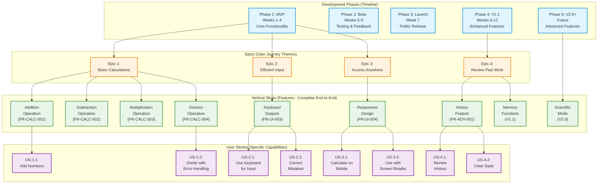
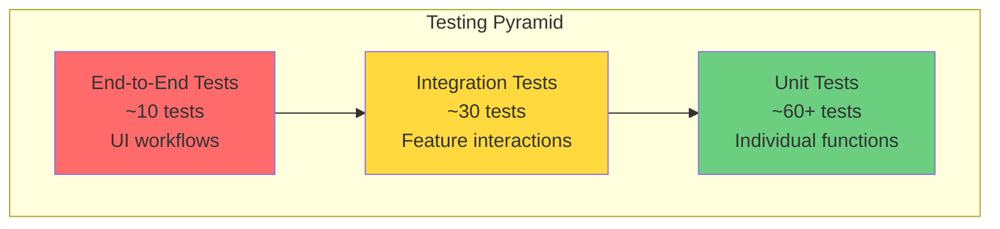

# Functional Requirements Specification: Web Calculator

## Document Information

| Property          | Value                                                               |
| ----------------- | ------------------------------------------------------------------- |
| Document Type     | Functional Requirements Specification (FRS)                         |
| Product           | Web Calculator                                                      |
| Version           | 1.0                                                                 |
| Last Updated      | 2026-02-12                                                          |
| Related Documents | [Product Requirements Document](./web-calculator-prd.md)            |
| Status            | Draft                                                               |
| Audience          | Development team, QA engineers, technical stakeholders              |

## Table of Contents

1. [Introduction](#introduction)
2. [System Overview](#system-overview)
3. [Functional Requirements](#functional-requirements)
4. [Data Specifications](#data-specifications)
5. [Interface Specifications](#interface-specifications)
6. [Business Rules](#business-rules)
7. [State Management](#state-management)
8. [Error Handling](#error-handling)
9. [Non-Functional Requirements](#non-functional-requirements)
10. [Dependencies and Constraints](#dependencies-and-constraints)
11. [Test Requirements](#test-requirements)
12. [Acceptance Criteria](#acceptance-criteria)
13. [Traceability Matrix](#traceability-matrix)

## 1. Introduction

### 1.1 Purpose

This Functional Requirements Specification (FRS) defines the detailed functional and technical requirements for the Web Calculator application. It serves as the authoritative source for development, testing, and validation activities.

### 1.2 Scope

This document covers:

- Detailed functional requirements for all calculator operations
- Data models and structures
- User interface specifications
- Business logic and rules
- Error handling and validation
- State management specifications
- Performance and quality requirements

### 1.3 Definitions and Acronyms

| Term          | Definition                                                                     |
| ------------- | ------------------------------------------------------------------------------ |
| Expression    | A mathematical statement containing numbers and operators (e.g., "2 + 3 × 4") |
| Operand       | A number or value in a calculation                                             |
| Operator      | A mathematical symbol (+, -, ×, ÷) that performs an operation                  |
| PEMDAS        | Order of operations: Parentheses, Exponents, Multiplication/Division, Add/Sub  |
| FCP           | First Contentful Paint - performance metric                                    |
| TTI           | Time to Interactive - performance metric                                       |
| WCAG          | Web Content Accessibility Guidelines                                           |
| ARIA          | Accessible Rich Internet Applications                                          |
| localStorage  | Browser storage API for persisting data locally                                |

### 1.4 References

- [Web Calculator PRD](./web-calculator-prd.md)
- IEEE Standard 830-1998 for Software Requirements Specifications
- WCAG 2.1 Accessibility Guidelines
- MDN Web Docs - JavaScript Math operations

## 2. System Overview

### 2.1 Development Structure: Phases, Slices, and User Stories

The Web Calculator follows an incremental delivery approach where features are implemented as vertical slices, organized into epics, and delivered across multiple phases.

#### Relationship Diagram



#### Key Concepts

**Development Phases** (Timeline-based):
- **Phase 1 (MVP)**: Core calculation functionality, weeks 1-4
- **Phase 2 (Beta)**: Testing and feedback collection, weeks 5-6
- **Phase 3 (Launch)**: Public release, week 7
- **Phase 4 (V1.1)**: Enhanced features (history, memory), weeks 8-12
- **Phase 5 (V2.0+)**: Advanced features (scientific mode, unit conversion)

**Epics** (User Journey Themes):
- **Epic 1 - Basic Calculations**: Core arithmetic operations
- **Epic 2 - Efficient Input**: Keyboard support and error correction
- **Epic 3 - Access Anywhere**: Responsive design and accessibility
- **Epic 4 - Review Past Work**: History and state management

**Vertical Slices** (Complete Features):
- Each slice is a complete vertical implementation (UI → Logic → State → Display)
- Delivers end-to-end user value
- Can be independently tested and deployed
- Maps to functional requirements (FR-*)

**User Stories** (Specific Capabilities):
- Granular user-facing capabilities
- Format: "As a [user], I want to [action] so that [benefit]"
- Testable with specific acceptance criteria
- Multiple stories may be delivered by a single slice

#### Example: Addition Operation Vertical Slice

```
Vertical Slice: Addition Operation (FR-CALC-001)
├── UI Layer:      [+] button + keyboard "+" handler
├── Input Handler: Operator input validation
├── State Manager: Store operator and operands
├── Calculation:   Decimal.plus() with precision
├── Display:       Show expression and result
└── Tests:         TC-ADD-001 through TC-ADD-005

Delivers User Story: US-1.1 "Add two or more numbers"
Part of Epic: Epic 1 "Basic Calculations"
Delivered in: Phase 1 (MVP)
```

#### Slice Implementation Priority

**Priority Levels** (aligned with MoSCoW method):
- **P0 (Must Have)**: MVP features - required for launch
- **P1 (Should Have)**: V1.1 features - important but not blocking
- **P2 (Could Have)**: V2.0+ features - nice to have, future consideration
- **P3 (Won't Have)**: Explicitly deferred or rejected

### 2.2 Slice Demonstration and Stakeholder Showcase

Each completed vertical slice SHOULD be demonstrated to stakeholders to validate requirements, gather feedback, and maintain alignment with business objectives.

#### 2.2.1 Purpose of Slice Demonstrations

**Primary Objectives**:

- **Validate Requirements**: Confirm the implementation meets stated requirements
- **Gather Feedback**: Collect stakeholder input while changes are still easy to make
- **Build Confidence**: Show tangible progress and maintain stakeholder engagement
- **Identify Issues Early**: Surface usability problems, missing features, or misunderstandings
- **Celebrate Progress**: Recognize team achievements and maintain momentum

**Stakeholder Benefits**:

- See working software frequently (not just at final release)
- Provide input that shapes the product
- Understand technical constraints and trade-offs
- Feel ownership and investment in the product

#### 2.2.2 Pre-Demonstration Preparation

**Checklist** (Complete 24 hours before demo):

- [ ] **Slice Completion Verified**: All acceptance criteria met
- [ ] **Tests Passing**: Automated test suite at 100% pass rate
- [ ] **Demo Environment Ready**: Clean, stable environment with no unrelated bugs
- [ ] **Test Data Prepared**: Realistic scenarios ready to demonstrate
- [ ] **Demo Script Created**: Step-by-step walkthrough planned (see below)
- [ ] **Backup Plan**: Screenshots/video available if live demo fails
- [ ] **Stakeholders Invited**: Calendar invites sent with clear agenda
- [ ] **Access Provided**: Stakeholders can access demo environment (URL shared)
- [ ] **Documentation Ready**: Slice completion document available (e.g., SLICE-N-COMPLETE.md)

**Demo Environment Setup**:

```bash
# Example: Running demo locally
npm run build              # Production build
npm run preview            # Serve production build
# Share local URL via ngrok or similar for remote stakeholders
```

**OR use deployed demo environment**:

- Demo URL: `https://calculator-demo.example.com/slice-N`
- Versioned by slice for concurrent demos
- Reset data between demos (fresh state)

#### 2.2.3 Demo Structure (Recommended 15-30 minutes)

**Timing Breakdown**:

| Segment               | Duration | Purpose                              |
| --------------------- | -------- | ------------------------------------ |
| Introduction          | 2-3 min  | Context, objectives, what's new      |
| Live Demonstration    | 10-15 min| Show features, happy path + edge cases|
| Q&A / Exploratory     | 5-8 min  | Stakeholder questions and exploration|
| Feedback Collection   | 3-5 min  | Structured feedback capture          |
| Wrap-up / Next Steps  | 2-3 min  | Summary, action items, next demo     |

#### 2.2.4 Demo Script Template

**1. Introduction (2-3 minutes)**

*"Good [morning/afternoon], everyone. Today we're showcasing [Slice Name], which delivers [primary user value]. This slice completes [Epic Name] and brings us [X%] toward MVP completion."*

**What to Cover**:
- Which slice is being demonstrated (e.g., "Slice 0: Foundation" or "Slice 1: Number Input")
- User stories delivered
- How it fits into the overall product
- What stakeholders should focus on

**Example (Slice 0: Foundation)**:

*"This is Slice 0, our foundation slice. It establishes the basic calculator UI and event system. While it doesn't perform calculations yet, it demonstrates the visual design, responsive layout, and framework that all future slices will build upon."*

---

**2. Live Demonstration (10-15 minutes)**

**Part A: Happy Path** (Show it working as intended)

*"Let me walk through the typical user workflow..."*

**Demonstration Steps** (adapt per slice):

1. **Show Initial State**
   - Open calculator in browser
   - Point out key UI elements (display, buttons, layout)
   - Mention responsive design (resize window)

2. **Demonstrate Core Functionality**
   - Walk through primary user story
   - Narrate actions: *"I'm clicking the '2' button..."*
   - Highlight output: *"Notice the display updates immediately"*

3. **Show Integration Points**
   - How this slice connects to previous slices
   - Preserved functionality from earlier work

**Example (Slice 1: Number Input)**:

```
Demo Flow:
1. "Let me enter a number: 1-2-3"
   → Show display updating
2. "Now I'll add a decimal: point, 4-5"
   → Show decimal validation (only one decimal allowed)
3. "Let's try entering invalid input..."
   → Show error handling (letters rejected)
4. "Here's keyboard input working..."
   → Type numbers using keyboard
5. "And on mobile..."
   → Switch to responsive view (DevTools or actual device)
```

**Part B: Edge Cases** (Show error handling and boundaries)

*"Now let's see how it handles edge cases..."*

**Demonstrate**:
- Boundary conditions (very long numbers, max digits)
- Error states (invalid input, constraints)
- Recovery (clear, backspace)

**Example**:

```
"What if I try to enter a second decimal point?"
→ Rejected, only first decimal accepted

"What happens at the digit limit?"
→ Additional digits ignored, or notation applied

"How do I correct a mistake?"
→ Backspace removes last digit
```

**Part C: Non-Functional Requirements** (if applicable)

- **Accessibility**: Demonstrate keyboard navigation, screen reader (if stakeholder interested)
- **Performance**: "Notice the instant response time"
- **Responsive Design**: Show on different viewport sizes

---

**3. Q&A and Exploratory Session (5-8 minutes)**

*"I'll hand you the controls now. Feel free to try anything—break it if you can!"*

**Facilitation Tips**:

- Share demo URL for stakeholders to try themselves
- Encourage experimentation: *"Try edge cases, see if you can find issues"*
- Observe how stakeholders interact (usability insights)
- Take notes on confusion points or questions
- Don't be defensive about bugs—log them and move on

**Capture**:
- Write down questions
- Note any confusion or hesitation
- Log bugs discovered in real-time

---

**4. Feedback Collection (3-5 minutes)**

**Structured Questions** (asked verbally or via form):

| Question                                      | Purpose                        |
| --------------------------------------------- | ------------------------------ |
| "Does this meet your expectations for [feature]?" | Validate requirements          |
| "Is anything missing or unexpected?"          | Identify gaps                  |
| "How intuitive is the [interaction/flow]?"    | Usability assessment           |
| "Any concerns about [performance/design]?"    | Surface quality issues         |
| "What should we prioritize for the next slice?" | Input on roadmap               |

**Feedback Capture Methods**:

- **Live Notes**: Scribe captures feedback in shared doc
- **Survey**: Post-demo form (Google Forms, Typeform)
- **Recording**: Record session (with permission) for later review
- **Issue Tracker**: Log bugs and enhancement requests in GitHub Issues

**Example Feedback Template**:

```markdown
## Slice N Demo Feedback - [Date]

**Attendees**: [Names/Roles]

### What Worked Well
- [Positive feedback item 1]
- [Positive feedback item 2]

### Issues Identified
| Issue | Severity | Action Item |
|-------|----------|-------------|
| [Description] | P0/P1/P2 | [Assigned to] |

### Enhancement Requests
- [Request 1] - Priority: P1/P2
- [Request 2] - Priority: P1/P2

### Questions/Clarifications Needed
- [Question 1] - Owner: [Name]
- [Question 2] - Owner: [Name]

### Decisions Made
- [Decision 1]
- [Decision 2]
```

---

**5. Wrap-up and Next Steps (2-3 minutes)**

*"Thank you for your feedback. Here's what we heard..."*

**Summarize**:
- Key feedback themes
- Decisions made during the demo
- Action items (assigned to specific people)
- Timeline for fixes or changes

**Preview Next Demo**:
- Which slice is next
- Expected delivery date
- What stakeholders should expect

**Example**:

*"We heard that the decimal input is intuitive, but you'd like clearer visual feedback on the digit limit. We'll add that before the next slice. Next demo will be Slice 2: Basic Operations (Addition/Subtraction) in 3 days. We'll show actual calculations working end-to-end. Thank you!"*

#### 2.2.5 What to Highlight for Stakeholders

**Technical Stakeholders** (CTO, Architects, Developers):
- Code quality and architecture decisions
- Test coverage and quality metrics
- Performance characteristics
- Technical debt or constraints
- Integration points and APIs

**Business Stakeholders** (Product Owners, Managers, Executives):
- User value delivered
- Progress toward MVP goals
- Timeline and velocity metrics
- Risk mitigation
- Budget implications

**End Users / User Proxies** (UX, Customer Success, Beta Testers):
- Usability and intuitiveness
- Visual design and consistency
- Accessibility features
- Mobile experience
- Error messages and help text

#### 2.2.6 Common Pitfalls to Avoid

**❌ Don't**:
- Show unstable or buggy features (not ready for demo)
- Dive into technical implementation details unless asked
- Apologize excessively for incomplete features ("This doesn't work yet, but...")
- Skip preparation and "wing it"
- Ignore or dismiss stakeholder feedback
- Go over time without consent

**✅ Do**:
- Rehearse demo at least once before presenting
- Start with working features that provide value
- Be honest about what's not done yet
- Celebrate progress and team effort
- Take feedback seriously (even if you disagree)
- Keep energy positive and collaborative
- Have a backup plan if live demo fails

#### 2.2.7 Post-Demo Actions

**Immediately After (Within 1 hour)**:
- [ ] Send thank-you email to attendees
- [ ] Share feedback summary document
- [ ] Log bugs/issues in tracking system (GitHub Issues)
- [ ] Assign action items with owners

**Within 24 Hours**:
- [ ] Prioritize feedback (P0/P1/P2)
- [ ] Update backlog with enhancement requests
- [ ] Update slice documentation with any decisions made
- [ ] Schedule follow-up for any unresolved questions

**Within 1 Week**:
- [ ] Address P0 issues (blocking bugs)
- [ ] Communicate progress on action items
- [ ] Adjust roadmap if needed based on feedback
- [ ] Prepare for next slice demo

#### 2.2.8 Example: Slice 1 Demo Plan

**Slice**: Number Input and Display

**User Stories Delivered**:
- US-1.1: Enter single-digit numbers
- US-1.2: Enter multi-digit numbers
- US-1.3: Enter decimal numbers

**Demo Scenario**:

```
1. Introduction (2 min)
   "Today we're showing Slice 1: Number Input. Users can now 
    enter numbers including decimals, and the display updates in real-time."

2. Happy Path Demo (8 min)
   - Enter "123" → Display shows "123"
   - Enter "45.67" → Display shows "45.67"
   - Use keyboard to enter "890" → Works
   - Switch to mobile view → Touch input works

3. Edge Cases (5 min)
   - Try entering "12.34.56" → Second decimal rejected ✓
   - Reach digit limit (10 digits) → Additional input blocked ✓
   - Type letters → Rejected ✓
   - Backspace to correct → Last digit removed ✓

4. Q&A (5 min)
   - Let stakeholders try it
   - Answer questions
   - Note any confusion

5. Feedback (3 min)
   - "Does number entry feel intuitive?"
   - "Any unexpected behavior?"
   - "Is the visual feedback clear?"

6. Wrap-up (2 min)
   - "Next slice: Addition and subtraction operations"
   - "Expected demo: 3 days"
   - "Thanks for your feedback!"
```

**Success Criteria for Demo**:
- All stakeholders understand what was delivered
- At least 3 pieces of actionable feedback received
- No P0 bugs discovered (or if discovered, immediately logged)
- Stakeholders express confidence in progress

---

### 2.3 System Context

The Web Calculator is a client-side web application that runs entirely in the user's browser. It requires no server-side components for core functionality.

```
┌─────────────────────────────────────────┐
│           User's Browser                │
│  ┌───────────────────────────────────┐  │
│  │     Web Calculator Application    │  │
│  │  ┌─────────────────────────────┐  │  │
│  │  │   Calculation Engine        │  │  │
│  │  ├─────────────────────────────┤  │  │
│  │  │   State Manager             │  │  │
│  │  ├─────────────────────────────┤  │  │
│  │  │   UI Components             │  │  │
│  │  ├─────────────────────────────┤  │  │
│  │  │   Input Handler             │  │  │
│  │  ├─────────────────────────────┤  │  │
│  │  │   Storage Manager (V1.1+)   │  │  │
│  │  └─────────────────────────────┘  │  │
│  └───────────────────────────────────┘  │
│              │                          │
│              ▼                          │
│     ┌─────────────────┐                │
│     │  localStorage   │                │
│     └─────────────────┘                │
└─────────────────────────────────────────┘
```

### 2.4 High-Level Architecture

**Component Breakdown:**

1. **Calculation Engine**: Processes mathematical expressions and returns results
2. **State Manager**: Maintains application state (current value, expression, history)
3. **UI Components**: Renders calculator interface (display, buttons)
4. **Input Handler**: Processes user input from mouse, touch, and keyboard
5. **Storage Manager**: Manages localStorage for history and preferences (V1.1+)

### 2.5 User Interactions Flow

```
User Input → Input Handler → State Update → Calculation Engine → Result → Display Update
                    │                                                           │
                    └───────────────────────────────────────────────────────────┘
                                    (Continuous feedback loop)
```

## 3. Functional Requirements

### 3.1 Calculation Operations (FR-CALC)

#### FR-CALC-001: Addition Operation

**Priority**: P0 (Must Have - MVP)

**Description**: The system shall support addition of two or more numbers.

**Detailed Requirements**:

1. The system SHALL accept numeric input for the first operand
2. The system SHALL recognize the addition operator (+) via button click or keyboard
3. The system SHALL accept numeric input for the second operand
4. The system SHALL compute the sum when the equals operator is invoked
5. The system SHALL support chained additions (e.g., 2 + 3 + 4 + 5)
6. The system SHALL handle negative numbers in addition operations
7. The system SHALL handle decimal numbers with up to 10 decimal places precision
8. The system SHALL display the running total during chained additions

**Implementation Details**:

```javascript
// Pseudo-code specification
function add(operand1, operand2) {
  // SHALL use Decimal library or equivalent for precision
  return Decimal(operand1).plus(operand2);
}
```

**Test Cases**:

| Test ID     | Input       | Expected Output | Type            |
| ----------- | ----------- | --------------- | --------------- |
| TC-ADD-001  | 5 + 3       | 8               | Basic addition  |
| TC-ADD-002  | 0.1 + 0.2   | 0.3             | Decimal         |
| TC-ADD-003  | -5 + 3      | -2              | Negative        |
| TC-ADD-004  | 2 + 3 + 4   | 9               | Chained         |
| TC-ADD-005  | 999999999   | Overflow check  | Edge case       |

**Acceptance Criteria**:

- ✓ Addition produces mathematically correct results for all test cases
- ✓ Floating-point precision maintained to 10 decimal places
- ✓ Chained additions accumulate correctly
- ✓ Display updates after each addition operation

---

#### FR-CALC-002: Subtraction Operation

**Priority**: P0 (Must Have - MVP)

**Description**: The system shall support subtraction of numbers.

**Detailed Requirements**:

1. The system SHALL accept numeric input for the minuend
2. The system SHALL recognize the subtraction operator (-) via button click or keyboard
3. The system SHALL accept numeric input for the subtrahend
4. The system SHALL compute the difference when the equals operator is invoked
5. The system SHALL support chained subtractions (left-to-right evaluation)
6. The system SHALL handle results that produce negative numbers
7. The system SHALL differentiate between subtraction operator and negative number sign

**Implementation Details**:

```javascript
// Pseudo-code specification
function subtract(operand1, operand2) {
  return Decimal(operand1).minus(operand2);
}
```

**Test Cases**:

| Test ID     | Input       | Expected Output | Type            |
| ----------- | ----------- | --------------- | --------------- |
| TC-SUB-001  | 10 - 3      | 7               | Basic           |
| TC-SUB-002  | 3 - 10      | -7              | Negative result |
| TC-SUB-003  | 5 - 2 - 1   | 2               | Chained         |
| TC-SUB-004  | 0.3 - 0.1   | 0.2             | Decimal         |

**Acceptance Criteria**:

- ✓ Subtraction produces correct mathematical results
- ✓ Negative results displayed with minus sign prefix
- ✓ Chained subtractions evaluate left-to-right
- ✓ Clear distinction between operator and negative sign

---

#### FR-CALC-003: Multiplication Operation

**Priority**: P0 (Must Have - MVP)

**Description**: The system shall support multiplication of numbers.

**Detailed Requirements**:

1. The system SHALL accept numeric input for the multiplicand
2. The system SHALL recognize the multiplication operator (×) via button click or "*" from keyboard
3. The system SHALL accept numeric input for the multiplier
4. The system SHALL compute the product when equals operator is invoked
5. The system SHALL support chained multiplications
6. The system SHALL correctly interact with addition/subtraction per order of operations
7. The system SHALL handle multiplication by zero
8. The system SHALL handle multiplication by one (identity property)

**Implementation Details**:

```javascript
// Pseudo-code specification
function multiply(operand1, operand2) {
  return Decimal(operand1).times(operand2);
}
```

**Test Cases**:

| Test ID     | Input         | Expected Output | Type             |
| ----------- | ------------- | --------------- | ---------------- |
| TC-MUL-001  | 5 × 3         | 15              | Basic            |
| TC-MUL-002  | 7 × 0         | 0               | Zero property    |
| TC-MUL-003  | 8 × 1         | 8               | Identity         |
| TC-MUL-004  | 2 × 3 × 4     | 24              | Chained          |
| TC-MUL-005  | 2 + 3 × 4     | 14              | Order of ops     |
| TC-MUL-006  | 0.1 × 0.1     | 0.01            | Decimal          |

**Acceptance Criteria**:

- ✓ Multiplication produces correct results
- ✓ Zero and identity properties respected
- ✓ Order of operations correctly prioritizes multiplication
- ✓ Decimal multiplication maintains precision

---

#### FR-CALC-004: Division Operation

**Priority**: P0 (Must Have - MVP)

**Description**: The system shall support division of numbers with proper error handling.

**Detailed Requirements**:

1. The system SHALL accept numeric input for the dividend
2. The system SHALL recognize the division operator (÷) via button click or "/" from keyboard
3. The system SHALL accept numeric input for the divisor
4. The system SHALL compute the quotient when equals operator is invoked
5. The system SHALL detect division by zero and prevent calculation
6. The system SHALL display error message "Cannot divide by zero" for division by zero
7. The system SHALL support chained divisions (left-to-right evaluation)
8. The system SHALL handle division that produces decimal results
9. The system SHALL correctly interact with other operators per order of operations

**Implementation Details**:

```javascript
// Pseudo-code specification
function divide(operand1, operand2) {
  if (Decimal(operand2).equals(0)) {
    throw new Error("Cannot divide by zero");
  }
  return Decimal(operand1).dividedBy(operand2);
}
```

**Test Cases**:

| Test ID     | Input         | Expected Output          | Type             |
| ----------- | ------------- | ------------------------ | ---------------- |
| TC-DIV-001  | 15 ÷ 3        | 5                        | Basic            |
| TC-DIV-002  | 10 ÷ 0        | Error message            | Division by zero |
| TC-DIV-003  | 1 ÷ 3         | 0.3333333333             | Repeating decimal|
| TC-DIV-004  | 20 ÷ 4 ÷ 2    | 2.5                      | Chained          |
| TC-DIV-005  | 8 ÷ 2 + 3     | 7                        | Order of ops     |

**Acceptance Criteria**:

- ✓ Division produces correct quotients
- ✓ Division by zero displays specific error message
- ✓ Error state prevents further invalid operations
- ✓ Decimal results displayed with appropriate precision
- ✓ Order of operations correctly prioritizes division

---

#### FR-CALC-005: Order of Operations (PEMDAS)

**Priority**: P0 (Must Have - MVP)

**Description**: The system shall evaluate expressions according to standard mathematical order of operations.

**Detailed Requirements**:

1. The system SHALL evaluate multiplication before addition
2. The system SHALL evaluate division before subtraction
3. The system SHALL evaluate multiplication and division left-to-right when both present
4. The system SHALL evaluate addition and subtraction left-to-right when both present
5. The system SHALL maintain operator precedence:
   - Level 1 (Highest): Parentheses (Future: V2.0)
   - Level 2: Multiplication, Division
   - Level 3 (Lowest): Addition, Subtraction
6. The system SHALL display intermediate results during expression building

**Implementation Details**:

```javascript
// Pseudo-code specification
// Use Shunting Yard algorithm or equivalent for parsing
function evaluateExpression(expression) {
  // Convert infix notation to postfix (RPN)
  // Evaluate postfix expression with operator precedence
  // Return final result
}
```

**Test Cases**:

| Test ID     | Input         | Expected Output | Reason                    |
| ----------- | ------------- | --------------- | ------------------------- |
| TC-ORD-001  | 2 + 3 × 4     | 14              | Mult before add           |
| TC-ORD-002  | 10 - 6 ÷ 2    | 7               | Div before sub            |
| TC-ORD-003  | 2 × 3 + 4 × 5 | 26              | Multiple operators        |
| TC-ORD-004  | 8 ÷ 4 × 2     | 4               | Left-to-right same level  |
| TC-ORD-005  | 10 - 3 + 2    | 9               | Left-to-right add/sub     |

**Acceptance Criteria**:

- ✓ All test cases produce mathematically correct results
- ✓ Expression evaluation follows PEMDAS rules
- ✓ Same-level operators evaluate left-to-right
- ✓ Display shows running calculation appropriately

---

#### FR-CALC-006: Decimal Number Support

**Priority**: P0 (Must Have - MVP)

**Description**: The system shall support decimal numbers with appropriate precision.

**Detailed Requirements**:

1. The system SHALL accept decimal point input via button or keyboard "."
2. The system SHALL allow only one decimal point per number
3. The system SHALL support up to 15 digits of input (including decimal)
4. The system SHALL maintain 10 decimal places precision in calculations
5. The system SHALL display results with appropriate decimal formatting
6. The system SHALL handle leading zeros appropriately (0.5, not .5)
7. The system SHALL handle trailing zeros appropriately (display simplification)
8. The system SHALL correctly handle floating-point edge cases (0.1 + 0.2 = 0.3)

**Implementation Details**:

```javascript
// Use Decimal.js or Big.js to avoid floating-point errors
const Decimal = require('decimal.js');
Decimal.set({ precision: 20, rounding: 4 });

// Input validation
function isValidDecimalInput(currentValue, newChar) {
  if (newChar === '.' && currentValue.includes('.')) {
    return false; // Only one decimal point allowed
  }
  if (currentValue.replace('.', '').length >= 15) {
    return false; // Max 15 digits
  }
  return true;
}
```

**Test Cases**:

| Test ID     | Input         | Expected Output | Type                    |
| ----------- | ------------- | --------------- | ----------------------- |
| TC-DEC-001  | 0.5 + 0.5     | 1               | Basic decimal           |
| TC-DEC-002  | 0.1 + 0.2     | 0.3             | Floating-point accuracy |
| TC-DEC-003  | 5.5..         | Reject 2nd "."  | Invalid input           |
| TC-DEC-004  | 1 ÷ 3         | 0.3333333333    | Precision test          |
| TC-DEC-005  | 0.123456789012345 | Accept      | Max digits              |

**Acceptance Criteria**:

- ✓ Decimal operations produce accurate results
- ✓ No floating-point precision errors
- ✓ Multiple decimal points rejected
- ✓ Display formatting clear and readable

---

#### FR-CALC-007: Negative Number Support

**Priority**: P0 (Must Have - MVP)

**Description**: The system shall support negative numbers in all operations.

**Detailed Requirements**:

1. The system SHALL accept negative numbers as operands
2. The system SHALL differentiate between minus operator and negative sign
3. The system SHALL support negative results from operations
4. The system SHALL display negative numbers with leading minus sign
5. The system SHALL support negative number as first operand
6. The system SHALL handle double negatives appropriately

**Test Cases**:

| Test ID     | Input         | Expected Output | Type              |
| ----------- | ------------- | --------------- | ----------------- |
| TC-NEG-001  | -5 + 3        | -2              | Negative first    |
| TC-NEG-002  | 5 + (-3)      | 2               | Negative second   |
| TC-NEG-003  | -5 × -3       | 15              | Both negative     |
| TC-NEG-004  | 3 - 10        | -7              | Negative result   |
| TC-NEG-005  | -(-5)         | 5               | Double negative   |

**Acceptance Criteria**:

- ✓ Negative numbers handled correctly in all operations
- ✓ Clear visual distinction between operator and sign
- ✓ Negative results displayed correctly

---

### 3.2 User Interface Requirements (FR-UI)

#### FR-UI-001: Calculator Display

**Priority**: P0 (Must Have - MVP)

**Description**: The system shall provide a clear, readable display for input and results.

**Detailed Requirements**:

1. The system SHALL provide a display area minimum 200px wide × 60px tall
2. The system SHALL display current expression during input
3. The system SHALL display result after calculation
4. The system SHALL use minimum 24px font size for primary display text
5. The system SHALL use minimum 16px font size for expression preview
6. The system SHALL maintain 4.5:1 contrast ratio (WCAG AA)
7. The system SHALL right-align numbers in display
8. The system SHALL handle overflow text with truncation or scrolling
9. The system SHALL differentiate visually between input and result states
10. The system SHALL update display immediately upon input

**Visual Specification**:

```
┌────────────────────────────────────┐
│ Expression: 2 + 3 × 4       (16px) │ ← Secondary display (optional)
│ Result: 14              (24px+)    │ ← Primary display
└────────────────────────────────────┘
```

**CSS Requirements**:

```css
.calculator-display {
  min-width: 200px;
  min-height: 60px;
  font-size: 24px;
  text-align: right;
  padding: 10px;
  background-color: #ffffff;
  color: #000000; /* 21:1 contrast ratio */
  border: 1px solid #cccccc;
  overflow: hidden;
  text-overflow: ellipsis;
}

.calculator-display-expression {
  font-size: 16px;
  color: #666666;
  opacity: 0.8;
}
```

**Test Cases**:

| Test ID     | Scenario              | Expected Behavior               |
| ----------- | --------------------- | ------------------------------- |
| TC-DIS-001  | Initial load          | Display shows "0"               |
| TC-DIS-002  | Number input          | Number appears in display       |
| TC-DIS-003  | Calculation result    | Result replaces expression      |
| TC-DIS-004  | Long number (20 digits) | Scrolling or truncation      |
| TC-DIS-005  | Error state           | Error message displayed         |

**Acceptance Criteria**:

- ✓ Display clearly visible from 2 feet away
- ✓ Contrast ratio meets WCAG AA standards
- ✓ Text updates with <16ms latency (1 frame at 60fps)
- ✓ Overflow handled gracefully

---

#### FR-UI-002: Button Grid Interface

**Priority**: P0 (Must Have - MVP)

**Description**: The system shall provide a button-based interface for all calculator operations.

**Detailed Requirements**:

1. The system SHALL provide number buttons 0-9
2. The system SHALL provide operator buttons: +, -, ×, ÷
3. The system SHALL provide equals button (=)
4. The system SHALL provide clear button (C)
5. The system SHALL provide backspace/delete button (←)
6. The system SHALL provide decimal point button (.)
7. The system SHALL ensure all buttons minimum 44×44px (WCAG touch target)
8. The system SHALL provide visual feedback on hover (desktop)
9. The system SHALL provide visual feedback on active/pressed state
10. The system SHALL provide focus indicator for keyboard navigation
11. The system SHALL disable buttons when operation is invalid
12. The system SHALL use distinct visual styling for different button types

**Button Layout Specification**:

```
┌───────────────────────────────────────┐
│          [   Display   ]              │
├────────┬────────┬────────┬────────────┤
│   7    │   8    │   9    │     ÷      │
├────────┼────────┼────────┼────────────┤
│   4    │   5    │   6    │     ×      │
├────────┼────────┼────────┼────────────┤
│   1    │   2    │   3    │     -      │
├────────┼────────┼────────┼────────────┤
│   0    │   .    │   =    │     +      │
├────────┴────────┴────────┴────────────┤
│   C (Clear)     │   ← (Backspace)     │
└─────────────────┴─────────────────────┘
```

**Button Categories and Styling**:

| Category      | Buttons     | Color (Suggested)  | Purpose           |
| ------------- | ----------- | ------------------ | ----------------- |
| Numbers       | 0-9         | Light gray (#f0f0f0) | Data input      |
| Operators     | +, -, ×, ÷  | Orange (#ff9500)   | Operations        |
| Equals        | =           | Green (#34c759)    | Calculate result  |
| Functions     | C, ←, .     | Dark gray (#666)   | Control functions |

**CSS Requirements**:

```css
.calculator-button {
  min-width: 44px;
  min-height: 44px;
  font-size: 18px;
  border: 1px solid #ccc;
  cursor: pointer;
  transition: background-color 0.15s ease;
}

.calculator-button:hover {
  filter: brightness(0.95);
}

.calculator-button:active {
  transform: scale(0.98);
  filter: brightness(0.9);
}

.calculator-button:focus {
  outline: 2px solid #0066cc;
  outline-offset: 2px;
}

.calculator-button:disabled {
  opacity: 0.5;
  cursor: not-allowed;
}
```

**Test Cases**:

| Test ID     | Action                | Expected Behavior                |
| ----------- | --------------------- | -------------------------------- |
| TC-BTN-001  | Click number button   | Number input to display          |
| TC-BTN-002  | Click operator button | Operator registered              |
| TC-BTN-003  | Hover over button     | Background color change          |
| TC-BTN-004  | Tab navigation        | Focus moves logically            |
| TC-BTN-005  | Click disabled button | No action occurs                 |
| TC-BTN-006  | Touch on mobile       | Touch event triggers correctly   |

**Acceptance Criteria**:

- ✓ All buttons minimum 44×44px touch targets
- ✓ Visual feedback on all interaction states
- ✓ Focus indicator clearly visible (2px minimum)
- ✓ Button styling consistent and accessible
- ✓ Disabled buttons visually distinct

---

#### FR-UI-003: Keyboard Support

**Priority**: P0 (Must Have - MVP)

**Description**: The system shall support complete keyboard operation.

**Detailed Requirements**:

1. The system SHALL accept number keys 0-9 for digit input
2. The system SHALL accept operator keys: +, -, *, / for operations
3. The system SHALL accept Enter/Return key for equals operation
4. The system SHALL accept Escape key for clear operation
5. The system SHALL accept Backspace/Delete key to remove last digit
6. The system SHALL accept period/decimal key for decimal point
7. The system SHALL support Tab key for button navigation
8. The system SHALL support Shift+Tab for reverse navigation
9. The system SHALL prevent default browser behavior for handled keys
10. The system SHALL display visual focus indicator during keyboard navigation
11. The system SHALL provide keyboard shortcut documentation

**Keyboard Mapping Table**:

| Keyboard Key    | Calculator Function | Alternative Key |
| --------------- | ------------------- | --------------- |
| 0-9             | Number input        | Numpad 0-9      |
| +               | Addition            | Numpad +        |
| -               | Subtraction         | Numpad -        |
| * (asterisk)    | Multiplication      | Numpad *        |
| / (slash)       | Division            | Numpad /        |
| . (period)      | Decimal point       | Numpad .        |
| Enter / Return  | Equals              | Numpad Enter    |
| Escape          | Clear               | -               |
| Backspace       | Delete last digit   | Delete          |
| Tab             | Next button         | -               |
| Shift+Tab       | Previous button     | -               |

**Implementation Details**:

```javascript
// Pseudo-code specification
document.addEventListener('keydown', (event) => {
  const key = event.key;
  
  // Number keys
  if (/^[0-9]$/.test(key)) {
    handleNumberInput(key);
    event.preventDefault();
  }
  
  // Operators
  if (['+', '-', '*', '/'].includes(key)) {
    handleOperator(key);
    event.preventDefault();
  }
  
  // Special keys
  if (key === 'Enter') {
    handleEquals();
    event.preventDefault();
  }
  
  if (key === 'Escape') {
    handleClear();
    event.preventDefault();
  }
  
  if (key === 'Backspace' || key === 'Delete') {
    handleBackspace();
    event.preventDefault();
  }
  
  if (key === '.') {
    handleDecimal();
    event.preventDefault();
  }
});
```

**Test Cases**:

| Test ID     | Keyboard Input  | Expected Behavior        |
| ----------- | --------------- | ------------------------ |
| TC-KEY-001  | Press "5"       | "5" appears in display   |
| TC-KEY-002  | Press "+"       | Addition operator set    |
| TC-KEY-003  | Press "Enter"   | Calculation executed     |
| TC-KEY-004  | Press "Escape"  | Calculator cleared       |
| TC-KEY-005  | Press "Backspace" | Last digit removed     |
| TC-KEY-006  | Press "Tab"     | Focus moves to next button |
| TC-KEY-007  | Numpad keys     | Same as main keyboard    |

**Acceptance Criteria**:

- ✓ All calculator functions accessible via keyboard
- ✓ No keyboard traps (can navigate away)
- ✓ Focus indicator always visible
- ✓ Keyboard mappings intuitive and documented
- ✓ Both main and numpad keys supported

---

#### FR-UI-004: Responsive Design

**Priority**: P0 (Must Have - MVP)

**Description**: The system shall adapt to different screen sizes and devices.

**Detailed Requirements**:

1. The system SHALL support devices from 320px width minimum
2. The system SHALL provide optimized layouts for three breakpoints:
   - Mobile: 320px - 767px
   - Tablet: 768px - 1023px
   - Desktop: 1024px+
3. The system SHALL maintain minimum 44×44px touch targets on mobile
4. The system SHALL scale buttons proportionally on larger screens
5. The system SHALL support both portrait and landscape orientations
6. The system SHALL not require horizontal scrolling
7. The system SHALL use viewport meta tag for proper mobile rendering
8. The system SHALL test across major browsers and devices

**Breakpoint Specifications**:

**Mobile (320px - 767px)**:

```css
@media (max-width: 767px) {
  .calculator {
    max-width: 100%;
    margin: 10px;
  }
  
  .calculator-button {
    min-width: 60px;
    min-height: 60px;
    font-size: 20px;
  }
  
  .calculator-display {
    font-size: 28px;
    min-height: 70px;
  }
}
```

**Tablet (768px - 1023px)**:

```css
@media (min-width: 768px) and (max-width: 1023px) {
  .calculator {
    max-width: 400px;
    margin: 20px auto;
  }
  
  .calculator-button {
    min-width: 70px;
    min-height: 70px;
    font-size: 22px;
  }
}
```

**Desktop (1024px+)**:

```css
@media (min-width: 1024px) {
  .calculator {
    max-width: 400px;
    margin: 40px auto;
  }
  
  .calculator-button {
    min-width: 80px;
    min-height: 80px;
    font-size: 24px;
  }
  
  .calculator-button:hover {
    /* Hover effects only on desktop */
    background-color: ...;
  }
}
```

**HTML Requirements**:

```html
<meta name="viewport" content="width=device-width, initial-scale=1.0, maximum-scale=5.0">
```

**Test Cases**:

| Test ID     | Device/Size       | Expected Behavior              |
| ----------- | ----------------- | ------------------------------ |
| TC-RES-001  | iPhone SE (320px) | All buttons visible, usable    |
| TC-RES-002  | iPad (768px)      | Optimal layout, centered       |
| TC-RES-003  | Desktop (1920px)  | Centered, max 400px width      |
| TC-RES-004  | Orientation change | Layout adapts smoothly        |
| TC-RES-005  | 200% browser zoom | Remains functional             |

**Acceptance Criteria**:

- ✓ Calculator usable on all device sizes
- ✓ No horizontal scrolling required
- ✓ Touch targets meet size requirements
- ✓ Layout adapts smoothly between breakpoints
- ✓ Orientation changes handled gracefully

---

### 3.3 Control and Function Requirements (FR-FUNC)

#### FR-FUNC-001: Clear Operation

**Priority**: P0 (Must Have - MVP)

**Description**: The system shall provide a clear function to reset calculator state.

**Detailed Requirements**:

1. The system SHALL provide a Clear (C) button
2. The system SHALL clear the display when Clear is activated
3. The system SHALL reset current expression when Clear is activated
4. The system SHALL reset current operation state
5. The system SHALL set display to "0" after clear
6. The system SHALL NOT clear calculation history (V1.1+)
7. The system SHALL NOT clear memory value (V1.1+)
8. The system SHALL accept Escape key as clear shortcut
9. The system SHALL provide immediate visual feedback

**Implementation Details**:

```javascript
function handleClear() {
  state.currentValue = '0';
  state.previousValue = null;
  state.operator = null;
  state.expression = '';
  state.waitingForNewValue = false;
  state.errorState = false;
  updateDisplay('0');
}
```

**Test Cases**:

| Test ID     | Pre-Condition         | Action        | Expected Result  |
| ----------- | --------------------- | ------------- | ---------------- |
| TC-CLR-001  | Display shows "123"   | Press C       | Display shows "0"|
| TC-CLR-002  | Mid-calculation       | Press C       | Resets to "0"    |
| TC-CLR-003  | Error state           | Press C       | Clears error     |
| TC-CLR-004  | After equals          | Press C       | Starts fresh     |

**Acceptance Criteria**:

- ✓ Clear button resets display to "0"
- ✓ All operation state cleared
- ✓ History preserved (if implemented)
- ✓ Keyboard shortcut (Escape) works

---

#### FR-FUNC-002: Backspace/Delete Operation

**Priority**: P0 (Must Have - MVP)

**Description**: The system shall allow users to delete the last entered digit.

**Detailed Requirements**:

1. The system SHALL provide a Backspace (←) button
2. The system SHALL remove the last digit from current input
3. The system SHALL update display immediately after deletion
4. The system SHALL do nothing if display shows "0"
5. The system SHALL do nothing if display shows a result (after equals)
6. The system SHALL revert to "0" if last digit removed
7. The system SHALL handle decimal point deletion
8. The system SHALL accept keyboard Backspace/Delete key

**Implementation Details**:

```javascript
function handleBackspace() {
  // Don't backspace if waiting for new value
  if (state.waitingForNewValue) return;
  
  // Remove last character
  let currentValue = state.currentValue;
  if (currentValue.length > 1) {
    state.currentValue = currentValue.slice(0, -1);
  } else {
    state.currentValue = '0';
  }
  
  updateDisplay(state.currentValue);
}
```

**Test Cases**:

| Test ID     | Pre-Condition    | Action            | Expected Result |
| ----------- | ---------------- | ----------------- | --------------- |
| TC-BSP-001  | Display "123"    | Press ←           | Display "12"    |
| TC-BSP-002  | Display "5"      | Press ←           | Display "0"     |
| TC-BSP-003  | Display "0"      | Press ←           | Display "0"     |
| TC-BSP-004  | Display "1.5"    | Press ← twice     | Display "1"     |
| TC-BSP-005  | After equals     | Press ←           | No change       |

**Acceptance Criteria**:

- ✓ Last digit removed correctly
- ✓ Display updates immediately
- ✓ Handles edge cases (single digit, zero, decimal)
- ✓ Does not affect completed calculations

---

#### FR-FUNC-003: Equals Operation

**Priority**: P0 (Must Have - MVP)

**Description**: The system shall calculate and display results when equals is invoked.

**Detailed Requirements**:

1. The system SHALL provide an Equals (=) button
2. The system SHALL calculate result of current expression
3. The system SHALL display result in display area
4. The system SHALL clear expression after showing result
5. The system SHALL allow result to be used as first operand in next calculation
6. The system SHALL handle pressing equals with incomplete expression
7. The system SHALL handle pressing equals multiple times (repeat last operation)
8. The system SHALL accept Enter/Return key as equals shortcut

**Implementation Details**:

```javascript
function handleEquals() {
  if (!state.operator || !state.previousValue) {
    // Incomplete expression - do nothing or show current value
    return;
  }
  
  const result = calculate(
    state.previousValue,
    state.currentValue,
    state.operator
  );
  
  // Save for repeat operation
  state.lastOperation = {
    operator: state.operator,
    operand: state.currentValue
  };
  
  state.currentValue = result.toString();
  state.previousValue = null;
  state.operator = null;
  state.waitingForNewValue = true;
  
  updateDisplay(result);
}
```

**Test Cases**:

| Test ID     | Expression    | Action        | Expected Result |
| ----------- | ------------- | ------------- | --------------- |
| TC-EQL-001  | 5 + 3         | Press =       | Display "8"     |
| TC-EQL-002  | 10 - 4        | Press =       | Display "6"     |
| TC-EQL-003  | 3 × 4         | Press =       | Display "12"    |
| TC-EQL-004  | 15 ÷ 3        | Press =       | Display "5"     |
| TC-EQL-005  | 5 + 3 =       | Press = again | Display "11" (5+3+3) |
| TC-EQL-006  | 5             | Press =       | Display "5"     |

**Acceptance Criteria**:

- ✓ Correct calculations displayed
- ✓ Result can be reused in next calculation
- ✓ Handles repeat equals operation
- ✓ Incomplete expressions handled gracefully

---

### 3.4 Advanced Features (FR-ADV) - V1.1+

#### FR-ADV-001: Calculation History

**Priority**: P1 (Should Have - V1.1)

**Description**: The system shall maintain a history of recent calculations.

**Detailed Requirements**:

1. The system SHALL store the last 10 calculations
2. The system SHALL display expression and result for each history entry
3. The system SHALL allow users to click/tap history entry to recall
4. The system SHALL persist history in localStorage
5. The system SHALL provide a "Clear History" button
6. The system SHALL show history in reverse chronological order (newest first)
7. The system SHALL handle history storage quota gracefully
8. The system SHALL provide export functionality (copy to clipboard or download as text)

**Data Structure**:

```javascript
// History entry structure
interface HistoryEntry {
  id: string;          // Unique identifier (timestamp or UUID)
  expression: string;  // e.g., "5 + 3"
  result: string;      // e.g., "8"
  timestamp: number;   // Unix timestamp
}

// State management
const historyState = {
  entries: HistoryEntry[],  // Max 10 entries
  maxEntries: 10
};
```

**Storage Requirements**:

- Maximum history size: 10 entries
- Estimated storage: ~2KB
- Storage key: `calc_history`
- Format: JSON array

**Test Cases**:

| Test ID     | Scenario                  | Expected Behavior               |
| ----------- | ------------------------- | ------------------------------- |
| TC-HIS-001  | Complete calculation      | Entry added to history          |
| TC-HIS-002  | 11th calculation          | Oldest entry removed            |
| TC-HIS-003  | Click history entry       | Value recalled to display       |
| TC-HIS-004  | Clear history             | All entries removed             |
| TC-HIS-005  | Page refresh              | History persists                |
| TC-HIS-006  | Export history            | Text/CSV download available     |

**Acceptance Criteria**:

- ✓ History displays last 10 calculations
- ✓ History persists across browser sessions
- ✓ Click to recall functionality works
- ✓ Clear history requires confirmation
- ✓ Export generates readable format

---

## 4. Data Specifications

### 4.1 Calculator State Model

**State Structure**:

```typescript
interface CalculatorState {
  // Display and input
  currentValue: string;           // Current display value
  previousValue: string | null;   // Previous operand for binary operations
  expression: string;              // Current expression being built
  
  // Operation tracking
  operator: Operator | null;       // Current operator (+, -, ×, ÷)
  lastOperation: {                 // For repeat equals functionality
    operator: Operator;
    operand: string;
  } | null;
  
  // State flags
  waitingForNewValue: boolean;     // Whether next input starts new number
  errorState: boolean;             // Whether calculator is in error state
  errorMessage: string | null;     // Error message to display
  
  // Advanced features (V1.1+)
  memory: string | null;           // Memory value (MR/MS/MC/M+/M-)
  history: HistoryEntry[];         // Calculation history
}

type Operator = '+' | '-' | '×' | '÷';

interface HistoryEntry {
  id: string;
  expression: string;
  result: string;
  timestamp: number;
}
```

**Initial State**:

```javascript
const defaultState = {
  currentValue: '0',
  previousValue: null,
  expression: '',
  operator: null,
  lastOperation: null,
  waitingForNewValue: false,
  errorState: false,
  errorMessage: null,
  memory: null,
  history: []
};
```

### 4.2 Number Representation

**Specification**:

- **Type**: String (internal), Decimal object (calculation)
- **Maximum digits**: 15
- **Decimal precision**: 10 places
- **Range**: ±9,999,999,999,999,999 (15 digits)
- **Special values**: "0", "−0" (not displayed), "Infinity" (overflow), error states

**Validation Rules**:

```javascript
function isValidNumber(value) {
  // Must be parseable as number
  if (isNaN(parseFloat(value))) return false;
  
  // Maximum 15 digits (excluding decimal point and minus sign)
  const digitsOnly = value.replace(/[.-]/g, '');
  if (digitsOnly.length > 15) return false;
  
  // Only one decimal point allowed
  const decimalCount = (value.match(/\./g) || []).length;
  if (decimalCount > 1) return false;
  
  return true;
}
```

### 4.3 Expression Representation

**Format**: String with space-separated tokens

**Example**:

```
"5 + 3"
"2 + 3 × 4"
"10 ÷ 2 - 1"
```

**Parsing Rules**:

1. Numbers represented as strings
2. Operators represented as symbols: +, -, ×, ÷
3. Spaces used as delimiters
4. Left-to-right tokenization with operator precedence evaluation

### 4.4 localStorage Schema (V1.1+)

**Keys and Structure**:

```javascript
// History
localStorage.setItem('calc_history', JSON.stringify([
  {
    id: "1644679200000",
    expression: "5 + 3",
    result: "8",
    timestamp: 1644679200000
  },
  // ... up to 10 entries
]));

// User preferences (future)
localStorage.setItem('calc_preferences', JSON.stringify({
  theme: "light",
  soundEnabled: false
}));

// Memory value (session-persistent option)
localStorage.setItem('calc_memory', "42");
```

**Storage Management**:

- Maximum storage: ~5KB total
- Quota handling: Clear oldest entries if quota exceeded
- Error handling: Graceful degradation if localStorage unavailable

## 5. Interface Specifications

### 5.1 Button Interface Specification

**Button Types and Properties**:

| Button Type  | Examples       | Size (Desktop) | Color          | Font Size |
| ------------ | -------------- | -------------- | -------------- | --------- |
| Number       | 0, 1, 2, ..., 9 | 80×80px       | #f0f0f0        | 24px      |
| Operator     | +, -, ×, ÷     | 80×80px        | #ff9500        | 24px      |
| Equals       | =              | 80×80px        | #34c759        | 24px      |
| Function     | C, ←           | 80×80px        | #666666        | 20px      |
| Decimal      | .              | 80×80px        | #f0f0f0        | 28px      |

**Button States**:

1. **Default**: Normal appearance
2. **Hover**: Brightness reduced 5% (desktop only)
3. **Active/Pressed**: Scale 98%, brightness reduced 10%
4. **Focus**: 2px outline, #0066cc color
5. **Disabled**: Opacity 50%, cursor not-allowed

### 5.2 Display Interface Specification

**Display Zones**:

```
┌──────────────────────────────────────┐
│  Expression: 5 + 3 × 4  (Secondary)  │ ← 16px, gray, right-aligned
├──────────────────────────────────────┤
│  Result: 17             (Primary)    │ ← 28px, black, right-aligned, bold
└──────────────────────────────────────┘
```

**Display States**:

| State              | Primary Display | Secondary Display | Color   |
| ------------------ | --------------- | ----------------- | ------- |
| Initial            | "0"             | Empty             | Black   |
| Input              | Current number  | Expression so far | Black   |
| Calculation result | Result value    | Expression        | Black   |
| Error              | Error message   | Empty             | Red     |

### 5.3 Keyboard Interface Specification

**Event Handling**:

```javascript
document.addEventListener('keydown', (event) => {
  const { key, shiftKey, ctrlKey, metaKey } = event;
  
  // Ignore if modifier keys pressed (except allowed combinations)
  if (ctrlKey || metaKey) return;
  
  // Route to appropriate handler
  switch(key) {
    case '0': case '1': case '2': case '3': case '4':
    case '5': case '6': case '7': case '8': case '9':
      handleDigitInput(key);
      event.preventDefault();
      break;
    
    case '+': case '-': case '*': case '/':
      handleOperatorInput(key);
      event.preventDefault();
      break;
    
    case 'Enter':
      handleEquals();
      event.preventDefault();
      break;
    
    case 'Escape':
      handleClear();
      event.preventDefault();
      break;
    
    case 'Backspace':
    case 'Delete':
      handleBackspace();
      event.preventDefault();
      break;
    
    case '.':
      handleDecimalPoint();
      event.preventDefault();
      break;
  }
});
```

## 6. Business Rules

### 6.1 Calculation Rules

**BR-001: Division by Zero**

- **Rule**: Division by zero shall result in error state
- **Error Message**: "Cannot divide by zero"
- **Recovery**: Clear button returns to operational state
- **Implementation**: Check divisor before performing division

**BR-002: Order of Operations**

- **Rule**: Multiplication and division have higher precedence than addition and subtraction
- **Sub-rules**:
  - Same-level operators evaluate left-to-right
  - 2 + 3 × 4 must equal 14, not 20
- **Implementation**: Use operator precedence parser (e.g., Shunting Yard)

**BR-003: Number Range Limits**

- **Rule**: Numbers exceeding 15 digits shall be rejected or display error
- **Overflow handling**: Display "Error: Number too large"
- **Underflow handling**: Round to zero or display scientific notation

**BR-004: Decimal Precision**

- **Rule**: Internal calculations use 10 decimal places precision
- **Display rule**: Show minimum necessary decimals (trim trailing zeros)
- **Rounding**: Round-half-up for display purposes

**BR-005: Implicit Multiplication**

- **Rule**: NOT supported in MVP (e.g., "5(3)" does not mean "5 × 3")
- **Rationale**: Reduces ambiguity and complexity
- **Future**: May be added in scientific mode

### 6.2 Input Validation Rules

**BR-010: Single Decimal Point**

- **Rule**: Only one decimal point allowed per number
- **Enforcement**: Reject additional decimal point input
- **Visual feedback**: No change to display on invalid input

**BR-011: Leading Zeros**

- **Rule**: Leading zeros automatically removed, except "0." for decimals
- **Examples**:
  - Input "007" → Display "7"
  - Input "0.5" → Display "0.5"

**BR-012: Maximum Input Length**

- **Rule**: Maximum 15 digits per number
- **Enforcement**: Reject additional digit input
- **Visual feedback**: No change to display, optional audio/haptic feedback

**BR-013: Operator Chaining**

- **Rule**: Consecutive operators replace previous operator (except minus for negatives)
- **Example**: "5 + - ×" → Operator changes to ×
- **Special case**: "5 + -" → Preparing for negative number

### 6.3 Display Rules

**BR-020: Number Formatting**

- **Rule**: Numbers displayed with appropriate decimal places
- **Examples**:
  - 5.00 → "5"
  - 5.50 → "5.5"
  - 5.123456789012345 → "5.1234567890" (10 places max)

**BR-021: Negative Number Display**

- **Rule**: Negative numbers prefixed with minus sign "−"
- **No parentheses**: Use "-5" not "(5)"

**BR-022: Large Number Display**

- **Rule**: Numbers >15 digits trigger overflow error or scientific notation
- **Scientific notation**: 1.23×10¹⁵ (future enhancement)

## 7. State Management

### 7.1 State Transition Diagram

```
                    ┌─────────────┐
                    │   Initial   │
                    │  (Show "0") │
                    └──────┬──────┘
                           │
                    digit input
                           │
                           ▼
              ┌────────────────────────┐
              │   Entering First       │
              │      Number            │
              └──────┬─────────────────┘
                     │
              operator input
                     │
                     ▼
      ┌──────────────────────────────┐
      │   Operator Selected          │
      │   (Waiting for 2nd operand)  │
      └──────┬───────────────────────┘
             │
      digit input
             │
             ▼
┌────────────────────────────────┐
│    Entering Second Number      │
└──────┬─────────────────────────┘
       │
equals input
       │
       ▼
┌──────────────────┐
│  Show Result     │
└──────┬───────────┘
       │
 digit/operator
       │
       ▼
   (cycle)
```

### 7.2 State Transitions

**Transition Table**:

| Current State       | Input Type | Next State          | Action                        |
| ------------------- | ---------- | ------------------- | ----------------------------- |
| Initial             | Digit      | Entering First      | Start new number              |
| Initial             | Operator   | Entering First      | Apply to zero (e.g., 0 + ...) |
| Entering First      | Digit      | Entering First      | Append digit                  |
| Entering First      | Operator   | Operator Selected   | Save number, set operator     |
| Entering First      | Equals     | Show Result         | Show current number           |
| Operator Selected   | Digit      | Entering Second     | Start second number           |
| Operator Selected   | Operator   | Operator Selected   | Change operator               |
| Entering Second     | Digit      | Entering Second     | Append digit                  |
| Entering Second     | Operator   | Operator Selected   | Calculate result, set new op  |
| Entering Second     | Equals     | Show Result         | Calculate and display result  |
| Show Result         | Digit      | Entering First      | Start new calculation         |
| Show Result         | Operator   | Operator Selected   | Use result as first operand   |
| Show Result         | Equals     | Show Result         | Repeat last operation         |
| * (Any)             | Clear      | Initial             | Reset all state               |
| * (Any)             | Backspace  | (Same)              | Remove last digit             |

### 7.3 State Persistence

**Session State** (volatile):

- Current value
- Previous value
- Current operator
- Expression being built

**Persistent State** (V1.1+, localStorage):

- Calculation history
- Memory value (optional)
- User preferences

## 8. Error Handling

### 8.1 Error Categories

**Critical Errors** (Block further operation):

1. Division by zero
2. Number overflow
3. Invalid calculation state

**Non-Critical Errors** (Recoverable):

1. Invalid input (e.g., multiple decimal points)
2. Maximum digit length exceeded
3. localStorage quota exceeded

### 8.2 Error Handling Specifications

#### ERR-001: Division by Zero

**Trigger**: User attempts to divide any number by zero

**Behavior**:

1. Do not execute calculation
2. Set error state flag to true
3. Display error message: "Cannot divide by zero"
4. Disable number/operator inputs
5. Enable only Clear button

**Recovery**:

- User presses Clear → Return to initial state

**Implementation**:

```javascript
function handleDivision(dividend, divisor) {
  if (parseFloat(divisor) === 0) {
    state.errorState = true;
    state.errorMessage = 'Cannot divide by zero';
    updateDisplay('Cannot divide by zero');
    return;
  }
  
  return Decimal(dividend).dividedBy(divisor);
}
```

---

#### ERR-002: Number Overflow

**Trigger**: Result exceeds 15 digits

**Behavior**:

1. Detect overflow during calculation
2. Display error message: "Error: Number too large"
3. Set error state
4. Require clear to continue

**Recovery**:

- User presses Clear → Return to initial state

---

#### ERR-003: Invalid Input

**Trigger**: Attempt to enter invalid input (e.g., multiple decimals)

**Behavior**:

1. Reject input silently (no change to display)
2. Optional: Visual feedback (brief border flash or button shake)
3. Do not set error state (user can continue)

**Recovery**:

- Not needed (non-blocking error)

---

#### ERR-004: localStorage Unavailable

**Trigger**: localStorage blocked or full (V1.1+)

**Behavior**:

1. Gracefully degrade to session-only mode
2. Display notification: "History unavailable"
3. Continue core calculator functionality
4. Do not block user

**Recovery**:

- Runs without persistence features

---

### 8.3 Error Messages

**Standard Error Messages**:

| Error ID     | Message                           | User Action Required |
| ------------ | --------------------------------- | -------------------- |
| ERR-DIV-ZERO | "Cannot divide by zero"           | Press Clear          |
| ERR-OVERFLOW | "Error: Number too large"         | Press Clear          |
| ERR-INVALID  | (Silent rejection)                | Continue normally    |
| ERR-STORAGE  | "History unavailable"             | Acknowledge          |

**Error Message Styling**:

```css
.calculator-display.error {
  color: #ff3b30;
  background-color: #fff5f5;
  font-size: 18px;
  padding: 10px;
}
```

## 9. Non-Functional Requirements

### 9.1 Performance Requirements

#### NFR-PERF-001: Calculation Response Time

- **Requirement**: Calculations SHALL complete in <50ms
- **Measurement**: Time from equals button press to result display
- **Test method**: Automated performance testing with various expression complexities

#### NFR-PERF-002: UI Response Time

- **Requirement**: Button press SHALL provide visual feedback within <100ms (1 frame at 60fps = 16.67ms target)
- **Measurement**: Time from input event to display update
- **Test method**: High-speed recording and frame analysis

#### NFR-PERF-003: Page Load Performance

- **Requirement**:
  - First Contentful Paint (FCP): <1.5 seconds
  - Time to Interactive (TTI): <3 seconds
  - Total page size: <200KB (all assets)
- **Test method**: Lighthouse audits, WebPageTest

#### NFR-PERF-004: Animation Performance

- **Requirement**: UI animations SHALL maintain 60fps (no jank)
- **Test method**: Chrome DevTools performance profiling

---

### 9.2 Accessibility Requirements

#### NFR-A11Y-001: WCAG 2.1 AA Compliance

- **Requirement**: Application SHALL meet WCAG 2.1 Level AA standards
- **Specific requirements**:
  - Color contrast: 4.5:1 for normal text, 3:1 for large text
  - Keyboard accessibility: All functions operable via keyboard
  - Screen reader support: Proper ARIA labels and announcements
  - Focus indicators: Clearly visible (2px minimum)
  - Resizable text: Functional up to 200% zoom
- **Test method**: axe DevTools, manual testing with screen readers (NVDA, JAWS, VoiceOver)

#### NFR-A11Y-002: Touch Target Size

- **Requirement**: Interactive elements SHALL have minimum 44×44px touch targets
- **Test method**: Manual measurement, automated accessibility audits

#### NFR-A11Y-003: Screen Reader Support

- **Requirement**: All calculator functions SHALL be announced by screen readers
- **Implementation**:
  - Buttons have proper `aria-label` attributes
  - Display updates announced with `aria-live="polite"`
  - Error messages announced with `aria-live="assertive"`
- **Test method**: Manual testing with NVDA, JAWS, VoiceOver

---

### 9.3 Browser and Device Compatibility

#### NFR-COMPAT-001: Browser Support

- **Requirement**: Application SHALL function correctly on:
  - Chrome 90+ (Windows, Mac, Linux, Android)
  - Firefox 88+ (Windows, Mac, Linux)
  - Safari 13+ (Mac, iOS)
  - Edge 90+ (Windows, Mac)
- **No IE11 support required**
- **Test method**: Cross-browser testing suite (BrowserStack or similar)

#### NFR-COMPAT-002: Device Support

- **Requirement**: Application SHALL function on:
  - Smartphones: iPhone SE (320px width) and up
  - Tablets: iPad (768px width)
  - Desktops: 1024px width and up
  - 4K displays: 3840px width
- **Test method**: Responsive design testing tools, real device testing

#### NFR-COMPAT-003: Orientation Support

- **Requirement**: Application SHALL function in both portrait and landscape orientations
- **Test method**: Device orientation testing

---

### 9.4 Security Requirements

#### NFR-SEC-001: Input Sanitization

- **Requirement**: All user input SHALL be validated and sanitized
- **Protection against**: XSS, injection attacks
- **Implementation**: Input validation, output encoding
- **Test method**: Security scanning tools, penetration testing

#### NFR-SEC-002: Content Security Policy

- **Requirement**: Application SHALL implement strict Content Security Policy headers
- **Policy**: No inline scripts, no eval(), whitelisted domains only
- **Test method**: CSP validator, security headers check

#### NFR-SEC-003: Data Privacy

- **Requirement**: Application SHALL NOT transmit calculation data to servers
- **Requirement**: Application SHALL NOT use third-party analytics without consent
- **Requirement**: localStorage usage SHALL be documented in privacy policy
- **Test method**: Network traffic monitoring

---

### 9.5 Usability Requirements

#### NFR-USAB-001: Learnability

- **Requirement**: New users SHALL successfully complete basic calculations within 30 seconds of first use
- **Test method**: User testing with first-time users

#### NFR-USAB-002: Error Prevention

- **Requirement**: Application SHALL prevent invalid operations (e.g., multiple decimals)
- **Test method**: Exploratory testing, invalid input attempts

#### NFR-USAB-003: Consistency

- **Requirement**: Button behavior and layout SHALL remain consistent with standard calculator conventions
- **Test method**: Usability review against physical calculator standards

---

### 9.6 Reliability Requirements

#### NFR-REL-001: Availability

- **Requirement**: Application SHALL have 99.9% uptime (if hosted)
- **Measurement**: <8.76 hours downtime per year
- **Test method**: Uptime monitoring

#### NFR-REL-002: Calculation Accuracy

- **Requirement**: Calculations SHALL be mathematically correct with floating-point precision to 10 decimal places
- **Test method**: Automated test suite with known-correct results

#### NFR-REL-003: Error Recovery

- **Requirement**: Application SHALL recover from error states via Clear button
- **Requirement**: Application SHALL NOT crash or become unresponsive
- **Test method**: Error condition testing, stress testing

---

### 9.7 Maintainability Requirements

#### NFR-MAINT-001: Code Quality

- **Requirement**: Code SHALL follow established style guide (e.g., Airbnb JavaScript Style Guide)
- **Requirement**: Code SHALL include inline comments for complex logic
- **Test method**: Linter checks, code review

#### NFR-MAINT-002: Documentation

- **Requirement**: All functions SHALL have JSDoc-style documentation
- **Requirement**: README SHALL include setup and development instructions
- **Test method**: Documentation review

#### NFR-MAINT-003: Testing

- **Requirement**: Code coverage SHALL exceed 80%
- **Requirement**: All functional requirements SHALL have corresponding automated tests
- **Test method**: Coverage reports, test suite execution

---

### 9.8 Scalability Requirements

#### NFR-SCALE-001: History Storage (V1.1+)

- **Requirement**: Application SHALL handle up to 50 history entries without performance degradation
- **Test method**: Performance testing with maximum history size

#### NFR-SCALE-002: Concurrent Users (if hosted)

- **Requirement**: Application SHALL support 10,000 concurrent users (static hosting)
- **Note**: Client-side app requires no special backend scalability
- **Test method**: Load testing

---

## 10. Dependencies and Constraints

### 10.1 Technical Dependencies

**Required Libraries**:

| Library      | Version | Purpose                        | License |
| ------------ | ------- | ------------------------------ | ------- |
| Decimal.js   | 10.x    | Precision arithmetic           | MIT     |

**Optional Libraries** (V1.1+):

| Library      | Version | Purpose                        | License |
| ------------ | ------- | ------------------------------ | ------- |
| localForage  | 1.x     | Enhanced localStorage wrapper  | Apache 2.0 |

**Build Tools** (Development):

- Vite or Webpack for bundling
- ESLint for code quality
- Prettier for formatting
- Jest for unit testing
- Cypress for E2E testing

### 10.2 Browser API Dependencies

**Required APIs**:

- DOM API (Core)
- localStorage API (V1.1+, with graceful degradation)
- CSS Grid / Flexbox
- addEventListener (Keyboard/Click/Touch events)

**Optional APIs**:

- Service Worker (V1.1+ for offline support)
- Clipboard API (V1.1+ for history export)

### 10.3 Constraints

**Technical Constraints**:

1. Client-side only (no server-side logic required for MVP)
2. Must work offline (after initial load)
3. No external API dependencies for core functionality
4. Maximum bundle size: 50KB (gzipped)

**Business Constraints**:

1. MVP must launch within 4 weeks
2. Budget: <40 developer hours for MVP
3. No third-party paid services for MVP

**Regulatory Constraints**:

1. Must comply with WCAG 2.1 AA accessibility standards
2. Must have privacy policy if collecting any data (V1.1+)
3. GDPR compliant for EU users (localStorage consent)

### 10.4 Assumptions

1. Users have modern browsers (last 2 versions)
2. Users have JavaScript enabled
3. Users have minimum 320px viewport width
4. Users understand basic calculator operations
5. Internet connection available for initial page load

### 10.5 External Interfaces

**User Interface**:

- Web browser (Chrome, Firefox, Safari, Edge)
- Input devices: Mouse, touchscreen, keyboard
- Output: Visual display (screen)

**Software Interfaces**:

- Browser localStorage API (V1.1+)
- Browser clipboard API (V1.1+)

**No External System Interfaces Required** for MVP.

---

## 11. Test Requirements

### 11.1 Test Strategy

#### 11.1.1 Testing Philosophy

The Web Calculator SHALL employ a comprehensive testing strategy that includes:

- **Test-Driven Development (TDD)**: Write tests before implementation where practical
- **Continuous Testing**: Automated tests run on every commit
- **Shift-Left Testing**: Early testing integrated into development workflow
- **Risk-Based Testing**: Prioritize testing of critical calculation operations
- **Quality Gates**: Automated checks prevent regression

#### 11.1.2 Testing Pyramid

The testing approach SHALL follow the standard testing pyramid:



**Distribution**:

- **70%** Unit tests: Fast, isolated, high coverage
- **20%** Integration tests: Feature-level validation
- **10%** End-to-end tests: Critical user workflows

---

### 11.2 Test Levels

#### 11.2.1 Unit Testing

**Purpose**: Validate individual functions and modules in isolation

**Scope**:

- All calculation functions (add, subtract, multiply, divide)
- Input validation functions
- Number formatting functions
- State management functions
- Event handlers (logic only)
- Utility functions

**Requirements**:

- **Coverage**: Minimum 80% code coverage
- **Framework**: Vitest (preferred) or Jest
- **Speed**: All unit tests MUST complete in <5 seconds
- **Isolation**: Tests MUST NOT depend on external state or other tests
- **Deterministic**: Tests MUST produce consistent results on every run

**Test Data Requirements**:

- Boundary values (0, MAX_SAFE_INTEGER, MIN_SAFE_INTEGER)
- Typical values
- Edge cases (0.1 + 0.2, very small decimals)
- Invalid inputs (null, undefined, non-numeric)

**Example Test Cases**:

```javascript
// Unit test structure
describe('addition', () => {
  test('adds two positive integers correctly', () => {
    expect(add(2, 3)).toBe(5);
  });
  
  test('handles decimal precision correctly', () => {
    expect(add(0.1, 0.2)).toBe(0.3);
  });
  
  test('throws error for invalid input', () => {
    expect(() => add('a', 3)).toThrow();
  });
});
```

---

#### 11.2.2 Integration Testing

**Purpose**: Validate interactions between modules and features

**Scope**:

- Calculator state management integration
- Event bus communication between components
- Display updates in response to calculations
- Keyboard input integration with calculation engine
- Button clicks triggering correct operations

**Requirements**:

- **Framework**: Vitest with DOM testing utilities
- **Speed**: All integration tests MUST complete in <15 seconds
- **Environment**: JSDOM or happy-dom for DOM simulation
- **Coverage**: All user story acceptance criteria covered

**Test Scenarios**:

| Scenario                          | Description                                      |
| --------------------------------- | ------------------------------------------------ |
| Complete calculation workflow     | Input → Operation → Equals → Display result     |
| Chained operations                | Multiple operations maintaining state            |
| Error recovery                    | Error state → Clear → Normal operation           |
| Cross-feature interactions        | History + calculations + display updates         |

---

#### 11.2.3 End-to-End (E2E) Testing

**Purpose**: Validate complete user workflows in a real browser environment

**Scope**:

- Critical calculation workflows (5-10 tests)
- Multi-step user interactions
- Keyboard navigation flows
- Responsive design behavior
- Error handling flows

**Requirements**:

- **Framework**: Playwright (preferred) or Cypress
- **Browsers**: Chrome, Firefox, Safari (WebKit)
- **Speed**: All E2E tests MUST complete in <2 minutes
- **Reliability**: <5% flake rate (retry logic for network-dependent tests)

**Critical Test Flows**:

1. **Basic Calculation**: User enters "2 + 3 =" → Display shows "5"
2. **Order of Operations**: User enters "2 + 3 × 4 =" → Display shows "14"
3. **Error Recovery**: User enters "5 ÷ 0" → Error shown → Clear → Continue
4. **Keyboard Navigation**: Complete calculation using only keyboard
5. **Responsive Behavior**: Resize window → UI adapts correctly

---

#### 11.2.4 Manual Testing

**Purpose**: Validate aspects difficult to automate (UX, accessibility, visual design)

**Scope**:

- **Exploratory Testing**: Find unexpected issues
- **Usability Testing**: Real users complete tasks
- **Accessibility Testing**: Screen reader compatibility
- **Visual Regression**: Design consistency across browsers
- **Device Testing**: Physical device testing (phones, tablets)

**Requirements**:

- Minimum 5 hours exploratory testing before release
- Usability testing with 10+ representative users
- Screen reader testing with NVDA (Windows) and VoiceOver (macOS)
- Physical device testing on 3+ devices per platform (iOS, Android)

**Manual Test Checklist**:

- [ ] Visual design matches mockups
- [ ] Animations smooth (60fps)
- [ ] No visual glitches on zoom/resize
- [ ] Touch targets adequate size (44×44px minimum)
- [ ] Hover states work correctly
- [ ] Focus indicators visible
- [ ] Screen reader announces all content correctly
- [ ] Keyboard navigation logical and complete
- [ ] No keyboard traps
- [ ] Error messages clear and helpful

---

### 11.3 Test Coverage Requirements

#### 11.3.1 Code Coverage Targets

| Coverage Type       | Minimum | Target | Critical Paths |
| ------------------- | ------- | ------ | -------------- |
| Statement Coverage  | 80%     | 90%    | 100%           |
| Branch Coverage     | 75%     | 85%    | 100%           |
| Function Coverage   | 90%     | 95%    | 100%           |
| Line Coverage       | 80%     | 90%    | 100%           |

**Critical Paths** (requiring 100% coverage):

- All calculation functions (add, subtract, multiply, divide)
- Order of operations logic
- Division by zero handling
- Input validation
- Error state management

#### 11.3.2 Functional Coverage

**ALL functional requirements** (FR-*) MUST have:

- At least 3 positive test cases
- At least 2 negative test cases
- Boundary condition tests
- Integration test coverage

**Formula**: `Functional Coverage = (FRs with tests) / (Total FRs) × 100%`

**Target**: 100% of P0 requirements, 80% of P1 requirements

---

### 11.4 Test Automation

#### 11.4.1 Automation Requirements

**Automated Tests SHALL**:

- Run on every commit (CI/CD pipeline)
- Complete in <5 minutes total execution time
- Fail fast (stop on first critical failure)
- Generate coverage reports
- Report results to GitHub Actions / CI dashboard

**Automation Priorities**:

| Priority | Test Type               | Reason                          |
| -------- | ----------------------- | ------------------------------- |
| P0       | All calculation tests   | Core functionality              |
| P0       | Input validation tests  | Prevent invalid states          |
| P0       | Error handling tests    | Graceful failure                |
| P1       | UI interaction tests    | User experience                 |
| P1       | Responsive design tests | Multi-device support            |
| P2       | Visual regression tests | Design consistency              |

#### 11.4.2 CI/CD Integration

**Pipeline Stages**:

```yaml
# Example GitHub Actions workflow structure
stages:
  - lint: ESLint, Prettier
  - unit-tests: Vitest (with coverage)
  - integration-tests: Vitest (integration suite)
  - build: Production build
  - e2e-tests: Playwright (Chrome, Firefox, Safari)
  - coverage-report: Upload to Codecov
  - deploy: (on success)
```

**Quality Gates**:

- Lint: Zero errors (warnings allowed)
- Unit tests: 100% pass rate
- Integration tests: 100% pass rate
- Code coverage: ≥80% (blocks merge if fails)
- E2E tests: 100% pass rate (critical paths)
- Build: No build errors

---

### 11.5 Testing Tools and Frameworks

#### 11.5.1 Required Tools

| Tool       | Purpose                  | Version | License    |
| ---------- | ------------------------ | ------- | ---------- |
| Vitest     | Unit/Integration testing | 2.x     | MIT        |
| Playwright | E2E testing              | 1.x     | Apache 2.0 |
| happy-dom  | DOM simulation           | 14.x    | MIT        |

#### 11.5.2 Recommended Tools

| Tool           | Purpose                | Optional/Required |
| -------------- | ---------------------- | ----------------- |
| Codecov        | Coverage reporting     | Recommended       |
| axe-core       | Accessibility testing  | Required          |
| Lighthouse CI  | Performance testing    | Recommended       |
| ESLint         | Static analysis        | Required          |
| Prettier       | Code formatting        | Required          |

#### 11.5.3 Browser Testing Matrix

**Desktop Browsers**:

| Browser          | Min Version | E2E Tests | Manual Tests |
| ---------------- | ----------- | --------- | ------------ |
| Chrome/Edge      | Last 2      | ✓         | ✓            |
| Firefox          | Last 2      | ✓         | ✓            |
| Safari           | Last 2      | ✓         | ✓            |

**Mobile Browsers**:

| Browser          | Min Version | Device Testing | Emulator |
| ---------------- | ----------- | -------------- | -------- |
| Safari (iOS)     | iOS 15+     | ✓              | ✓        |
| Chrome (Android) | Android 10+ | ✓              | ✓        |

---

### 11.6 Test Environment

#### 11.6.1 Local Development Environment

**Requirements**:

- Node.js 18+ with npm/pnpm
- Vitest installed and configured
- Playwright browsers installed
- VSCode with recommended extensions (optional)

**Setup Commands**:

```bash
npm install                    # Install dependencies
npm test                       # Run unit tests
npm run test:coverage          # Run with coverage
npm run test:integration       # Run integration tests
npm run test:e2e               # Run E2E tests
npm run test:watch             # Watch mode (TDD)
```

#### 11.6.2 CI Environment

**Requirements**:

- GitHub Actions runner (ubuntu-latest)
- Node.js 18+ matrix
- Playwright browser binaries cached
- Parallel test execution enabled

**Performance Targets**:

- Total CI run time: <5 minutes
- Test execution time: <3 minutes
- Build time: <1 minute

---

### 11.7 Test Data Requirements

#### 11.7.1 Test Data Categories

**Boundary Values**:

- Zero: `0`
- MAX_SAFE_INTEGER: `9007199254740991`
- MIN_SAFE_INTEGER: `-9007199254740991`
- Very small: `0.0000000001`
- Very large: `999999999999`

**Typical Values**:

- Single digits: `1`, `5`, `9`
- Two digits: `12`, `45`, `99`
- Decimals: `3.14`, `0.5`, `123.456`
- Negatives: `-1`, `-42`, `-999`

**Edge Cases**:

- Floating point precision: `0.1 + 0.2 = 0.3`
- Repeating decimals: `1 ÷ 3 = 0.3333333333`
- Division by zero: `5 ÷ 0 = Error`
- Negative results: `3 - 10 = -7`

**Invalid Inputs**:

- `null`, `undefined`
- Non-numeric strings: `"abc"`
- Special characters: `!@#$%`
- Empty strings: `""`

#### 11.7.2 Test Data Management

- Test data SHALL be defined in separate fixtures files
- Test data SHALL NOT contain real user data
- Test data SHALL be version controlled
- Shared test data SHALL be documented

---

### 11.8 Testing Schedule

#### 11.8.1 MVP Timeline (4 weeks)

| Week | Phase                | Testing Activities                                           |
| ---- | -------------------- | ------------------------------------------------------------ |
| 1    | Foundation           | Setup test framework, write initial unit tests               |
| 2    | Core Features        | TDD for calculations, integration tests for state management |
| 3    | UI & Interactions    | E2E tests, keyboard navigation tests                         |
| 4    | Polish & Testing     | Manual testing, accessibility audit, bug fixes               |

#### 11.8.2 Test Milestones

**Week 1 Milestone**: Test framework operational

- [ ] Vitest configured and running
- [ ] Initial unit tests passing
- [ ] CI pipeline configured
- [ ] Coverage reporting enabled

**Week 2 Milestone**: Core functionality tested

- [ ] All calculation functions have 100% coverage
- [ ] State management fully tested
- [ ] Integration tests passing

**Week 3 Milestone**: User interactions tested

- [ ] E2E tests cover critical flows
- [ ] Keyboard navigation tested
- [ ] Responsive design verified

**Week 4 Milestone**: Release ready

- [ ] All automated tests passing
- [ ] Manual testing complete
- [ ] Accessibility audit complete
- [ ] Zero P0 bugs, <5 P1 bugs

---

### 11.9 Entry and Exit Criteria

#### 11.9.1 Test Entry Criteria

**Before Testing Begins**:

- [ ] Feature implementation complete (code review approved)
- [ ] Unit tests written and passing
- [ ] Test environment available and configured
- [ ] Test data prepared
- [ ] Acceptance criteria documented

#### 11.9.2 Test Exit Criteria

**Before Feature Marked Complete**:

- [ ] All test cases executed
- [ ] Test pass rate >95% (critical paths 100%)
- [ ] Code coverage meets minimums (80%+)
- [ ] No open P0 bugs
- [ ] <3 open P1 bugs with workarounds
- [ ] Manual testing complete
- [ ] Performance targets met

**Before Release**:

- [ ] All automated tests passing (100%)
- [ ] All P0 acceptance criteria met
- [ ] Accessibility audit complete (WCAG 2.1 AA)
- [ ] Cross-browser testing complete
- [ ] Performance testing complete (Lighthouse >90)
- [ ] Security review complete (if applicable)
- [ ] Regression testing complete

---

### 11.10 Defect Management

#### 11.10.1 Bug Severity Classification

| Severity | Definition                                  | Response Time | Example                       |
| -------- | ------------------------------------------- | ------------- | ----------------------------- |
| P0       | Blocks core functionality, no workaround    | <4 hours      | Calculator won't add numbers  |
| P1       | Major impact, workaround exists             | <1 day        | Keyboard shortcut broken      |
| P2       | Minor impact, low user impact               | <1 week       | Minor visual glitch           |
| P3       | Cosmetic, enhancement request               | Backlog       | Button color preference       |

#### 11.10.2 Bug Triage Process

1. **Report**: Developer/tester logs bug with reproduction steps
2. **Classify**: Assign severity (P0-P3)
3. **Assign**: Route to appropriate developer
4. **Fix**: Implement fix with regression test
5. **Verify**: Tester confirms fix in test environment
6. **Close**: Bug marked resolved after verification

#### 11.10.3 Regression Testing

**When Required**:

- Before every release
- After fixing P0/P1 bugs
- After refactoring core logic
- After dependency updates

**Scope**:

- Re-run all automated tests (unit, integration, E2E)
- Manual smoke testing of critical paths
- Verify related functionality not affected

---

### 11.11 Roles and Responsibilities

#### 11.11.1 Testing Roles

**Developer** (Primary):

- Write unit tests for all functions
- Write integration tests for features
- Achieve 80%+ code coverage
- Fix bugs identified in testing
- Participate in code reviews focusing on testability

**QA Engineer** (if available):

- Design test strategy and test plans
- Write and execute E2E tests
- Perform manual exploratory testing
- Conduct accessibility audits
- Manage defect lifecycle

**Product Owner**:

- Define acceptance criteria
- Participate in UAT (User Acceptance Testing)
- Prioritize bug fixes
- Sign off on releases

**DevOps Engineer**:

- Configure CI/CD pipelines
- Maintain test environments
- Monitor test execution metrics
- Optimize test performance

#### 11.11.2 Sign-off Requirements

**Before Release**:

- [ ] Development Lead: Code complete, tests passing
- [ ] QA Lead (if applicable): Testing complete, exit criteria met
- [ ] Product Owner: Acceptance criteria validated
- [ ] Accessibility Champion: WCAG 2.1 AA verified

---

### 11.12 Test Metrics and Reporting

#### 11.12.1 Key Test Metrics

**Quality Metrics**:

- Test pass rate (target: 100%)
- Code coverage percentage (target: 80%+)
- Defect density (bugs per KLOC)
- Defect detection rate
- Mean time to failure (MTTF)

**Efficiency Metrics**:

- Test execution time
- Test automation percentage (target: 90%)
- Time to fix defects (by severity)
- Test maintenance effort

**Progress Metrics**:

- Test cases executed vs planned
- Test coverage vs target
- Open defects by severity
- Release readiness score

#### 11.12.2 Test Reporting

**Daily** (Automated):

- CI/CD test results dashboard
- Coverage reports
- Failed test notifications

**Weekly** (Manual):

- Test execution summary
- Bug triage report
- Coverage trends
- Blockers and risks

**Release** (Manual):

- Comprehensive test summary
- Quality metrics dashboard
- Known issues list
- Recommendations for next release

---

### 11.13 Risk-Based Testing Priorities

#### 11.13.1 High-Risk Areas (Test First, Test More)

| Risk Area                  | Risk Level | Testing Priority | Mitigation Strategy             |
| -------------------------- | ---------- | ---------------- | ------------------------------- |
| Calculation accuracy       | High       | P0               | 100% coverage, extensive edge cases |
| Division by zero           | High       | P0               | Dedicated error handling tests  |
| Decimal precision          | High       | P0               | Test with Decimal.js library    |
| Order of operations        | High       | P0               | Complex expression test suite   |
| Cross-browser differences  | Medium     | P1               | E2E tests on 3+ browsers        |
| Keyboard accessibility     | Medium     | P1               | Automated keyboard nav tests    |

#### 11.13.2 Low-Risk Areas (Standard Testing)

- Visual styling (manual review sufficient)
- Button labels (visual inspection)
- Basic DOM rendering (integration tests)

---

## 12. Acceptance Criteria

### 11.1 MVP Acceptance Criteria

The MVP release SHALL be accepted if and only if ALL of the following criteria are met:

#### Functional Acceptance

- ✓ All P0 (Must Have) functional requirements implemented and tested
- ✓ All four basic operations (+, -, ×, ÷) produce correct results
- ✓ Order of operations (PEMDAS) correctly implemented
- ✓ Division by zero handled with appropriate error message
- ✓ Decimal numbers supported with 10-place precision
- ✓ Negative numbers supported
- ✓ Clear and backspace functions operational
- ✓ Keyboard support for all operations
- ✓ Responsive design functional on mobile, tablet, desktop

#### Quality Acceptance

- ✓ Zero critical (P0) bugs in production
- ✓ <5 medium (P1) bugs with workarounds documented
- ✓ Automated test suite passes 100% of test cases
- ✓ Code coverage >80%
- ✓ Manual testing completed on all supported browsers/devices

#### Performance Acceptance

- ✓ Page load time <2 seconds on 3G connection
- ✓ Calculation response time <100ms
- ✓ UI response time <100ms
- ✓ Lighthouse Performance score >90

#### Accessibility Acceptance

- ✓ WCAG 2.1 AA compliance verified by axe DevTools (zero violations)
- ✓ Manual screen reader testing passed (NVDA or JAWS)
- ✓ Keyboard navigation tested and functional
- ✓ Color contrast ratios meet standards

#### User Acceptance

- ✓ 100 beta testers completed at least 10 calculations each
- ✓ User satisfaction survey: >70% "satisfied" or "very satisfied"
- ✓ <10% of beta testers reported usability issues

---

### 11.2 Feature-Level Acceptance Criteria

#### Basic Operations

**Addition**:

- ✓ 5 + 3 = 8
- ✓ 0.1 + 0.2 = 0.3
- ✓ 2 + 3 + 4 = 9 (chained)

**Subtraction**:

- ✓ 10 - 3 = 7
- ✓ 3 - 10 = -7
- ✓ 5 - 2 - 1 = 2 (chained)

**Multiplication**:

- ✓ 5 × 3 = 15
- ✓ 7 × 0 = 0
- ✓ 2 + 3 × 4 = 14 (order of ops)

**Division**:

- ✓ 15 ÷ 3 = 5
- ✓ 10 ÷ 0 = error message
- ✓ 1 ÷ 3 = 0.3333333333 (precision)

#### User Interface

- ✓ All buttons minimum 44×44px
- ✓ Display contrast ratio ≥4.5:1
- ✓ Buttons provide visual feedback on press
- ✓ Focus indicators visible

#### Keyboard Support

- ✓ Number keys 0-9 work
- ✓ +, -, *, / keys work
- ✓ Enter triggers equals
- ✓ Escape clears calculator
- ✓ Backspace deletes last digit
- ✓ No keyboard traps

#### Responsive Design

- ✓ Functional at 320px width (iPhone SE)
- ✓ Functional at 768px width (iPad)
- ✓ Functional at 1920px width (desktop)
- ✓ No horizontal scrolling
- ✓ Orientation changes handled

---

## 13. Traceability Matrix

This matrix maps functional requirements to test cases and PRD features.

| FR ID        | Requirement Name          | PRD Feature | Test Cases                      | Priority |
| ------------ | ------------------------- | ----------- | ------------------------------- | -------- |
| FR-CALC-001  | Addition Operation        | F1.1        | TC-ADD-001 to TC-ADD-005        | P0       |
| FR-CALC-002  | Subtraction Operation     | F1.2        | TC-SUB-001 to TC-SUB-004        | P0       |
| FR-CALC-003  | Multiplication Operation  | F1.3        | TC-MUL-001 to TC-MUL-006        | P0       |
| FR-CALC-004  | Division Operation        | F1.4        | TC-DIV-001 to TC-DIV-005        | P0       |
| FR-CALC-005  | Order of Operations       | F1.5        | TC-ORD-001 to TC-ORD-005        | P0       |
| FR-CALC-006  | Decimal Support           | F1.6        | TC-DEC-001 to TC-DEC-005        | P0       |
| FR-CALC-007  | Negative Number Support   | F1.7        | TC-NEG-001 to TC-NEG-005        | P0       |
| FR-UI-001    | Calculator Display        | F2          | TC-DIS-001 to TC-DIS-005        | P0       |
| FR-UI-002    | Button Grid Interface     | F3          | TC-BTN-001 to TC-BTN-006        | P0       |
| FR-UI-003    | Keyboard Support          | F4          | TC-KEY-001 to TC-KEY-007        | P0       |
| FR-UI-004    | Responsive Design         | F5          | TC-RES-001 to TC-RES-005        | P0       |
| FR-FUNC-001  | Clear Operation           | F3.4        | TC-CLR-001 to TC-CLR-004        | P0       |
| FR-FUNC-002  | Backspace Operation       | F3.5        | TC-BSP-001 to TC-BSP-005        | P0       |
| FR-FUNC-003  | Equals Operation          | F3.3        | TC-EQL-001 to TC-EQL-006        | P0       |
| FR-ADV-001   | Calculation History       | F6          | TC-HIS-001 to TC-HIS-006        | P1       |

---

## Appendix A: Test Case Summary

**Total Test Cases**: 65+ covering all functional requirements

**Test Categories**:

- Calculation operations: 25 test cases
- User interface: 20 test cases
- Keyboard input: 10 test cases
- Responsive design: 5 test cases
- Error handling: 5 test cases

**Test Coverage Target**: >80% code coverage

---

## Appendix B: Glossary

| Term           | Definition                                                                     |
| -------------- | ------------------------------------------------------------------------------ |
| Operand        | A number or value in a mathematical expression                                 |
| Operator       | A symbol that performs a mathematical operation (+, -, ×, ÷)                   |
| Expression     | A combination of operands and operators (e.g., "2 + 3 × 4")                    |
| PEMDAS         | Mnemonic for order of operations (Parentheses, Exponents, Mult/Div, Add/Sub)   |
| Decimal.js     | JavaScript library for arbitrary-precision decimal arithmetic                  |
| Touch target   | Interactive area for touch input (minimum 44×44px per WCAG)                    |
| ARIA           | Accessible Rich Internet Applications (web accessibility standard)             |
| localStorage   | Browser API for persisting data locally                                        |
| Shunting Yard  | Algorithm for parsing mathematical expressions with operator precedence        |

---

## Appendix C: Related Documents

- [Web Calculator PRD](./web-calculator-prd.md) - Product Requirements Document
- [AI Chat Log](../ai-logs/2026/02/12/frs-creation-20260212-001/conversation.md) - Development conversation log

---

## Document History

| Version | Date       | Author       | Changes                          |
| ------- | ---------- | ------------ | -------------------------------- |
| 1.0     | 2026-02-12 | lyle.ubben   | Initial FRS creation             |

---

**End of Functional Requirements Specification**
