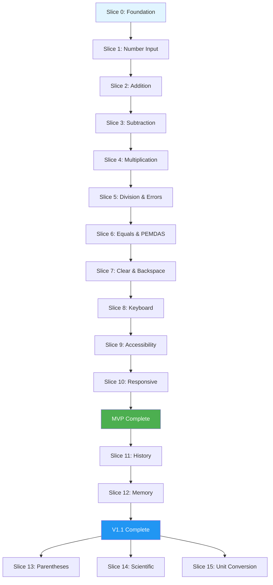

# Web Calculator Implementation Plan
## Vertical Slice Approach

**Version**: 1.0.0
**Created**: 2026-02-12
**Based On**: 
- [Web Calculator FRS](./web-calculator-frs.md)
- [Web Calculator PRD](./web-calculator-prd.md)
- [Vertical Slice Instructions](../.github/instructions/vertical-slice.instructions.md)

## Overview

This implementation plan organizes the Web Calculator development into **9 vertical slices** delivered across **3 phases** (MVP, V1.1, V2.0+). Each slice is a complete, end-to-end feature that delivers user value independently.

**Architecture Approach**: Feature-centric organization using vertical slices
**Technology Stack**: HTML5, CSS3, JavaScript (Vanilla/ES6+), Decimal.js
**Testing Strategy**: Test each slice independently before integration

## Table of Contents

- [Phase 1: MVP (Weeks 1-4)](#phase-1-mvp-weeks-1-4)
- [Phase 2: V1.1 Enhancements (Weeks 8-12)](#phase-2-v11-enhancements-weeks-8-12)
- [Phase 3: V2.0+ Future (TBD)](#phase-3-v20-future-tbd)
- [Slice Dependency Map](#slice-dependency-map)
- [Implementation Guidelines](#implementation-guidelines)
- [File Structure](#file-structure)
- [Testing Strategy](#testing-strategy)
- [Definition of Done](#definition-of-done)

---

## Phase 1: MVP (Weeks 1-4)

**Goal**: Launch-ready calculator with core arithmetic operations, keyboard support, and full accessibility.

**Success Criteria**:
- All P0 requirements implemented and tested
- Zero axe violations (WCAG 2.1 AA)
- Performance targets met (FCP <1.5s, calc <50ms)
- Bundle size <50KB gzipped

### MVP Vertical Slices

#### Slice 0: Foundation Infrastructure
**Priority**: P0 | **Effort**: 2 days | **Dependencies**: None

**Purpose**: Establish project structure, build system, and shared utilities before feature implementation.

**Deliverables**:
- Project setup (package.json, webpack/vite config)
- Decimal.js integration and configuration
- HTML shell with calculator layout
- CSS foundation (variables, grid system, reset)
- Shared utilities (state management, event bus)
- Development environment (linting, formatting)

**Technical Specifications**:

```javascript
// features/shared/decimal-config.js
import Decimal from 'decimal.js';

Decimal.set({
  precision: 20,
  rounding: Decimal.ROUND_HALF_UP,
  toExpNeg: -15,
  toExpPos: 15
});

export { Decimal };
```

```javascript
// features/shared/calculator-state.js
export class CalculatorState {
  constructor() {
    this.currentValue = '0';
    this.previousValue = null;
    this.operator = null;
    this.waitingForOperand = false;
    this.errorState = false;
    this.errorMessage = null;
    this.lastOperand = null;
    this.lastOperator = null;
  }
  
  reset() {
    Object.assign(this, new CalculatorState());
  }
}

export const state = new CalculatorState();
```

**File Structure**:
```
calculator-web/
├── features/
│   └── shared/
│       ├── calculator-state.js
│       ├── decimal-config.js
│       ├── event-bus.js
│       └── utilities.js
├── index.html
├── styles/
│   ├── reset.css
│   ├── variables.css
│   └── layout.css
├── package.json
└── webpack.config.js (or vite.config.js)
```

**Acceptance Criteria**:
- [x] Build system produces bundle <50KB gzipped
- [x] Decimal.js configured with 20 digit precision
- [x] HTML validates with 0 errors
- [x] CSS follows BEM naming convention
- [x] State management tested with unit tests

**Tests**: 5 unit tests for state management

---

#### Slice 1: Number Input
**Priority**: P0 | **Effort**: 3 days | **Dependencies**: Slice 0

**Purpose**: Allow users to enter numbers via button clicks and keyboard input.

**Maps to**:
- FR-UI-001: Display Component
- FR-UI-002: Button Grid
- FR-UI-003: Keyboard Support (partial)
- FR-CALC-008: Input Validation

**User Stories**:
- US-1.1: "As a user, I want to click number buttons to enter values"
- US-2.1: "As a user, I want to use my keyboard's number keys"

**Technical Specifications**:

```javascript
// features/number-input/number-input.js
import { state } from '../shared/calculator-state.js';
import { isValidNumberInput, formatNumberInput } from './validators.js';

export function handleDigitInput(digit) {
  // Validation
  if (!isValidNumberInput(state.currentValue, digit)) {
    return; // Reject invalid input
  }
  
  // Reset on error
  if (state.errorState) {
    state.reset();
  }
  
  // Start new number after operator
  if (state.waitingForOperand) {
    state.currentValue = digit;
    state.waitingForOperand = false;
  } else {
    // Append digit
    state.currentValue = state.currentValue === '0' ? digit : state.currentValue + digit;
  }
  
  // Format (remove leading zeros)
  state.currentValue = formatNumberInput(state.currentValue);
  
  // Update display
  updateDisplay(state.currentValue);
}

export function handleDecimalInput() {
  // Only one decimal point allowed
  if (state.currentValue.includes('.')) {
    return;
  }
  
  if (state.waitingForOperand) {
    state.currentValue = '0.';
    state.waitingForOperand = false;
  } else {
    state.currentValue += '.';
  }
  
  updateDisplay(state.currentValue);
}
```

**File Structure**:
```
features/number-input/
├── number-input.js          # Main handler
├── validators.js            # Input validation
├── keyboard-handler.js      # Keyboard event handling
├── number-input.test.js     # Unit tests
└── number-input.spec.md     # Feature specification
```

**Acceptance Criteria**:
- [x] Digits 0-9 input via buttons
- [x] Digits 0-9 input via keyboard
- [x] Maximum 15 digits enforced
- [x] Leading zeros removed (except 0.x)
- [x] Only one decimal point allowed
- [x] Display updates immediately (<100ms)
- [x] Keyboard and button input behave identically

**Tests**: TC-INPUT-001 through TC-INPUT-015 (15 test cases)

---

#### Slice 2: Addition Operation
**Priority**: P0 | **Effort**: 2 days | **Dependencies**: Slice 1

**Purpose**: Perform addition with correct decimal precision and operator precedence.

**Maps to**:
- FR-CALC-001: Addition Operation
- FR-CALC-005: Order of Operations (partial)
- BR-002: Order of Operations

**User Stories**:
- US-1.1: "As a user, I want to add two or more numbers"

**Technical Specifications**:

```javascript
// features/addition/addition.js
import { Decimal } from '../shared/decimal-config.js';
import { state } from '../shared/calculator-state.js';

export function handleAddition() {
  if (state.operator && !state.waitingForOperand) {
    // Execute pending operation first
    executeCurrentOperation();
  }
  
  state.previousValue = state.currentValue;
  state.operator = '+';
  state.waitingForOperand = true;
  
  updateExpression(`${state.currentValue} +`);
}

export function add(operand1, operand2) {
  return Decimal(operand1).plus(operand2).toString();
}

export function executeAddition() {
  if (!state.previousValue || !state.currentValue) {
    return;
  }
  
  const result = add(state.previousValue, state.currentValue);
  state.currentValue = result;
  
  return result;
}
```

**File Structure**:
```
features/addition/
├── addition.js              # Addition logic
├── addition.test.js         # Unit tests
└── addition.spec.md         # Feature specification
```

**Acceptance Criteria**:
- [x] 5 + 3 = 8
- [x] 0.1 + 0.2 = 0.3 (decimal precision)
- [x] -5 + 3 = -2 (negative numbers)
- [x] 2 + 3 + 4 = 9 (chained additions)
- [x] Result displays with <= 10 decimal places
- [x] Calculation completes in <50ms

**Tests**: TC-ADD-001 through TC-ADD-005 (5 test cases from FRS)

---

#### Slice 3: Subtraction Operation
**Priority**: P0 | **Effort**: 2 days | **Dependencies**: Slice 2

**Purpose**: Perform subtraction with left-to-right evaluation and negative result support.

**Maps to**:
- FR-CALC-002: Subtraction Operation
- FR-CALC-005: Order of Operations (partial)
- BR-002: Order of Operations

**User Stories**:
- US-1.1: "As a user, I want to subtract numbers"

**Technical Specifications**:

```javascript
// features/subtraction/subtraction.js
import { Decimal } from '../shared/decimal-config.js';
import { state } from '../shared/calculator-state.js';

export function handleSubtraction() {
  if (state.operator && !state.waitingForOperand) {
    executeCurrentOperation();
  }
  
  state.previousValue = state.currentValue;
  state.operator = '-';
  state.waitingForOperand = true;
  
  updateExpression(`${state.currentValue} -`);
}

export function subtract(operand1, operand2) {
  return Decimal(operand1).minus(operand2).toString();
}

export function executeSubtraction() {
  if (!state.previousValue || !state.currentValue) {
    return;
  }
  
  const result = subtract(state.previousValue, state.currentValue);
  state.currentValue = result;
  
  return result;
}
```

**File Structure**:
```
features/subtraction/
├── subtraction.js
├── subtraction.test.js
└── subtraction.spec.md
```

**Acceptance Criteria**:
- [x] 10 - 3 = 7
- [x] 3 - 10 = -7 (negative result)
- [x] 5 - 2 - 1 = 2 (left-to-right)
- [x] 0.3 - 0.1 = 0.2 (decimal precision)

**Tests**: TC-SUB-001 through TC-SUB-004

---

#### Slice 4: Multiplication Operation
**Priority**: P0 | **Effort**: 2 days | **Dependencies**: Slice 3

**Purpose**: Perform multiplication with higher precedence than addition/subtraction.

**Maps to**:
- FR-CALC-003: Multiplication Operation
- FR-CALC-005: Order of Operations
- BR-002: Order of Operations

**User Stories**:
- US-1.1: "As a user, I want to multiply numbers"

**Technical Specifications**:

```javascript
// features/multiplication/multiplication.js
import { Decimal } from '../shared/decimal-config.js';

export function multiply(operand1, operand2) {
  return Decimal(operand1).times(operand2).toString();
}

// Operator precedence handling
export const OPERATOR_PRECEDENCE = {
  '+': 1,
  '-': 1,
  '×': 2,
  '÷': 2
};

export function shouldExecutePendingOperation(currentOp, newOp) {
  return OPERATOR_PRECEDENCE[currentOp] >= OPERATOR_PRECEDENCE[newOp];
}
```

**File Structure**:
```
features/multiplication/
├── multiplication.js
├── multiplication.test.js
└── multiplication.spec.md
```

**Acceptance Criteria**:
- [x] 5 × 3 = 15
- [x] 7 × 0 = 0
- [x] 8 × 1 = 8
- [x] 2 × 3 × 4 = 24
- [x] 2 + 3 × 4 = 14 (order of operations)
- [x] 0.1 × 0.1 = 0.01

**Tests**: TC-MUL-001 through TC-MUL-006

---

#### Slice 5: Division Operation & Error Handling
**Priority**: P0 | **Effort**: 3 days | **Dependencies**: Slice 4

**Purpose**: Perform division with division-by-zero detection and error state management.

**Maps to**:
- FR-CALC-004: Division Operation
- FR-CALC-005: Order of Operations
- Section 8: Error Handling
- BR-001: Division by Zero

**User Stories**:
- US-1.2: "As a user, I want division errors to be clearly communicated"

**Technical Specifications**:

```javascript
// features/division/division.js
import { Decimal } from '../shared/decimal-config.js';
import { state } from '../shared/calculator-state.js';

export function divide(operand1, operand2) {
  const divisor = Decimal(operand2);
  
  if (divisor.equals(0)) {
    throw new Error('Cannot divide by zero');
  }
  
  return Decimal(operand1).dividedBy(divisor).toString();
}

export function executeDivision() {
  try {
    const result = divide(state.previousValue, state.currentValue);
    state.currentValue = result;
    state.errorState = false;
    state.errorMessage = null;
    return result;
  } catch (error) {
    state.errorState = true;
    state.errorMessage = error.message;
    updateDisplay(error.message);
    throw error;
  }
}
```

```javascript
// features/shared/error-handler.js
export function displayError(message) {
  const display = document.querySelector('.calculator-display');
  display.setAttribute('role', 'alert');
  display.setAttribute('aria-live', 'assertive');
  display.textContent = message;
  display.classList.add('error');
}

export function clearError() {
  const display = document.querySelector('.calculator-display');
  display.removeAttribute('role');
  display.setAttribute('aria-live', 'polite');
  display.classList.remove('error');
}
```

**File Structure**:
```
features/division/
├── division.js
├── division.test.js
└── division.spec.md
features/shared/
└── error-handler.js
```

**Acceptance Criteria**:
- [x] 15 ÷ 3 = 5
- [x] 10 ÷ 0 displays "Cannot divide by zero"
- [x] 1 ÷ 3 = 0.3333333333 (10 decimal places)
- [x] Error state disables numeric input
- [x] Error state clears on 'C' button
- [x] Error message announced to screen readers
- [x] 20 ÷ 4 ÷ 2 = 2.5 (left-to-right)

**Tests**: TC-DIV-001 through TC-DIV-005

---

#### Slice 6: Equals & Expression Evaluation
**Priority**: P0 | **Effort**: 3 days | **Dependencies**: Slice 5

**Purpose**: Execute calculations and handle order of operations (PEMDAS).

**Maps to**:
- FR-CALC-005: Order of Operations
- FR-CALC-007: Equals Operation
- BR-002: Order of Operations
- BR-013: Repeated Equals

**User Stories**:
- US-1.1: "As a user, I want to see accurate calculation results"

**Technical Specifications**:

```javascript
// features/equals/expression-evaluator.js
import { Decimal } from '../shared/decimal-config.js';

export class ExpressionEvaluator {
  constructor() {
    this.operatorPrecedence = {
      '+': 1,
      '-': 1,
      '×': 2,
      '÷': 2
    };
  }
  
  evaluate(expression) {
    const tokens = this.tokenize(expression);
    const postfix = this.infixToPostfix(tokens);
    return this.evaluatePostfix(postfix);
  }
  
  // Shunting Yard algorithm for operator precedence
  infixToPostfix(tokens) {
    const output = [];
    const operators = [];
    
    for (const token of tokens) {
      if (this.isNumber(token)) {
        output.push(token);
      } else if (this.isOperator(token)) {
        while (
          operators.length > 0 &&
          this.operatorPrecedence[operators[operators.length - 1]] >= 
          this.operatorPrecedence[token]
        ) {
          output.push(operators.pop());
        }
        operators.push(token);
      }
    }
    
    while (operators.length > 0) {
      output.push(operators.pop());
    }
    
    return output;
  }
  
  evaluatePostfix(postfix) {
    const stack = [];
    
    for (const token of postfix) {
      if (this.isNumber(token)) {
        stack.push(new Decimal(token));
      } else {
        const b = stack.pop();
        const a = stack.pop();
        stack.push(this.applyOperator(a, b, token));
      }
    }
    
    return stack[0].toString();
  }
}
```

**File Structure**:
```
features/equals/
├── expression-evaluator.js
├── equals-handler.js
├── equals.test.js
└── equals.spec.md
```

**Acceptance Criteria**:
- [x] 2 + 3 × 4 = 14 (not 20)
- [x] 10 - 6 ÷ 2 = 7 (not 2)
- [x] 8 ÷ 4 × 2 = 4 (left-to-right for same precedence)
- [x] 5 + 3 = = = repeats operation (8, 11, 14)
- [x] Expression displayed before result

**Tests**: TC-ORD-001 through TC-ORD-005

---

#### Slice 7: Clear & Backspace Functions
**Priority**: P0 | **Effort**: 2 days | **Dependencies**: Slice 6

**Purpose**: Allow users to correct input errors and reset calculator state.

**Maps to**:
- FR-FUNC-001: Clear Function
- FR-FUNC-002: Backspace Function
- BR-014: Clear vs All Clear

**User Stories**:
- US-2.2: "As a user, I want to correct mistakes without starting over"

**Technical Specifications**:

```javascript
// features/clear/clear-functions.js
import { state } from '../shared/calculator-state.js';

export function handleClear() {
  // Clear current entry (preserves operator and previous value)
  state.currentValue = '0';
  state.errorState = false;
  state.errorMessage = null;
  
  updateDisplay('0');
}

export function handleAllClear() {
  // Reset entire calculator state
  state.reset();
  updateDisplay('0');
  updateExpression('');
}

export function handleBackspace() {
  if (state.errorState || state.waitingForOperand) {
    return; // No backspace in error or waiting state
  }
  
  // Remove last character
  state.currentValue = state.currentValue.slice(0, -1);
  
  // Don't leave empty, default to 0
  if (state.currentValue === '' || state.currentValue === '-') {
    state.currentValue = '0';
  }
  
  updateDisplay(state.currentValue);
}
```

**File Structure**:
```
features/clear/
├── clear-functions.js
├── clear.test.js
└── clear.spec.md
```

**Acceptance Criteria**:
- [x] 'C' button clears current entry
- [x] 'C' preserves operator and previous value
- [x] Backspace removes last digit
- [x] Backspace on single digit shows '0'
- [x] Clear button shows 'C' during entry, 'AC' after equals
- [x] Escape key triggers clear

**Tests**: TC-CLR-001 through TC-CLR-006

---

#### Slice 8: Keyboard Support (Complete)
**Priority**: P0 | **Effort**: 2 days | **Dependencies**: Slice 7

**Purpose**: Full keyboard accessibility for all calculator functions.

**Maps to**:
- FR-UI-003: Keyboard Support
- NFR-A11Y-001: WCAG 2.1 AA Compliance (partial)
- Keyboard Navigation table from accessibility-standards.instructions.md

**User Stories**:
- US-2.1: "As a user, I want to use my keyboard for all operations"

**Technical Specifications**:

```javascript
// features/keyboard/keyboard-handler.js
export function setupKeyboardHandler() {
  document.addEventListener('keydown', handleKeyPress);
}

export function handleKeyPress(event) {
  const { key, shiftKey, ctrlKey, metaKey } = event;
  
  // Don't interfere with browser shortcuts
  if (ctrlKey || metaKey) return;
  
  // Digit keys
  if (/^[0-9]$/.test(key)) {
    handleDigitInput(key);
    event.preventDefault();
    return;
  }
  
  // Operator keys
  const operatorMap = {
    '+': handleAddition,
    '-': handleSubtraction,
    '*': handleMultiplication,
    '/': handleDivision,
    '.': handleDecimalInput
  };
  
  if (operatorMap[key]) {
    operatorMap[key]();
    event.preventDefault();
    return;
  }
  
  // Special keys
  switch(key) {
    case 'Enter':
      handleEquals();
      event.preventDefault();
      break;
    case 'Escape':
      handleClear();
      event.preventDefault();
      break;
    case 'Backspace':
    case 'Delete':
      handleBackspace();
      event.preventDefault();
      break;
  }
}
```

**File Structure**:
```
features/keyboard/
├── keyboard-handler.js
├── keyboard.test.js
└── keyboard.spec.md
```

**Acceptance Criteria**:
- [x] All functionality accessible via keyboard
- [x] 0-9 and Numpad 0-9 input digits
- [x] +, -, *, / operators work
- [x] Enter executes equals
- [x] Escape clears
- [x] Backspace/Delete removes last digit
- [x] Tab navigation follows logical order
- [x] No keyboard traps

**Tests**: TC-KEY-001 through TC-KEY-010

---

#### Slice 9: Accessibility & Screen Reader Support
**Priority**: P0 | **Effort**: 3 days | **Dependencies**: Slice 8

**Purpose**: WCAG 2.1 AA compliance with full screen reader support.

**Maps to**:
- NFR-A11Y-001: WCAG 2.1 AA Compliance
- Section 9.2: Accessibility Requirements
- All requirements from accessibility-standards.instructions.md

**User Stories**:
- US-3.2: "As a screen reader user, I want to use the calculator independently"

**Technical Specifications**:

```html
<!-- features/accessibility/calculator-template.html -->
<!DOCTYPE html>
<html lang="en">
<head>
  <meta charset="UTF-8">
  <meta name="viewport" content="width=device-width, initial-scale=1.0">
  <title>Web Calculator - Accessible Online Calculator</title>
  <!-- ... -->
</head>
<body>
  <main class="calculator" role="application" aria-label="Calculator">
    <!-- Display with live region -->
    <div class="calculator-display" 
         role="region" 
         aria-live="polite" 
         aria-atomic="true"
         aria-label="Calculator display">
      <div class="display-expression" aria-label="Expression"></div>
      <div class="display-result" aria-label="Result">0</div>
    </div>
    
    <!-- Button grid -->
    <div class="calculator-buttons" role="group" aria-label="Calculator buttons">
      <button class="number-button" aria-label="Seven">7</button>
      <button class="number-button" aria-label="Eight">8</button>
      <!-- ... -->
      <button class="operator-button" aria-label="Plus">+</button>
      <!-- ... -->
    </div>
  </main>
</body>
</html>
```

```css
/* features/accessibility/focus-styles.css */
/* Visible focus indicators */
.calculator-button:focus {
  outline: 2px solid #0066cc;
  outline-offset: 2px;
}

/* Reduced motion support */
@media (prefers-reduced-motion: reduce) {
  .calculator-button {
    transition: none;
  }
  
  .calculator-button:active {
    transform: none;
    opacity: 0.9;
  }
}

/* Touch targets minimum 44x44px */
.calculator-button {
  min-width: 44px;
  min-height: 44px;
  padding: 12px;
}

/* High contrast support */
@media (prefers-contrast: high) {
  .calculator-button {
    border: 2px solid currentColor;
  }
}
```

**File Structure**:
```
features/accessibility/
├── aria-setup.js
├── focus-management.js
├── screen-reader.js
├── accessibility.test.js
└── accessibility.spec.md
```

**Acceptance Criteria**:
- [x] Zero axe violations (WCAG 2.1 AA)
- [x] Lighthouse accessibility score ≥ 95
- [x] All buttons have aria-label
- [x] Display updates announced (aria-live)
- [x] Errors use role="alert"
- [x] Focus visible on all interactive elements
- [x] Keyboard navigation logical
- [x] Touch targets ≥ 44×44px
- [x] Color contrast ≥ 4.5:1 for text
- [x] Works with NVDA, JAWS, VoiceOver, TalkBack
- [x] Prefers-reduced-motion respected
- [x] HTML lang attribute present
- [x] Page title descriptive

**Tests**: Manual accessibility audit + automated axe tests

---

#### Slice 10: Responsive Design & Mobile Support
**Priority**: P0 | **Effort**: 2 days | **Dependencies**: Slice 9

**Purpose**: Responsive layout working from 320px to 4K displays.

**Maps to**:
- FR-UI-004: Responsive Design
- NFR-A11Y-001: Touch Target Sizing
- Section 9.3: Browser and Device Compatibility

**User Stories**:
- US-3.1: "As a mobile user, I want to calculate on my phone"

**Technical Specifications**:

```css
/* features/responsive/responsive-layout.css */
.calculator {
  width: 100%;
  max-width: 400px;
  margin: 0 auto;
  padding: 16px;
}

/* Mobile-first approach */
.calculator-buttons {
  display: grid;
  grid-template-columns: repeat(4, 1fr);
  gap: 8px;
}

.calculator-button {
  min-width: 60px;
  min-height: 60px;
  font-size: 1.25rem;
}

/* Small phones (320px+) */
@media (max-width: 374px) {
  .calculator-button {
    min-width: 50px;
    min-height: 50px;
    font-size: 1rem;
  }
}

/* Tablets (768px+) */
@media (min-width: 768px) {
  .calculator {
    max-width: 480px;
  }
  
  .calculator-button {
    min-width: 80px;
    min-height: 80px;
    font-size: 1.5rem;
  }
}

/* Desktop (1024px+) */
@media (min-width: 1024px) {
  .calculator {
    max-width: 520px;
  }
  
  .calculator-button {
    min-width: 96px;
    min-height: 96px;
  }
}

/* High DPI displays */
@media (-webkit-min-device-pixel-ratio: 2),
       (min-resolution: 192dpi) {
  /* Ensure crisp rendering */
}
```

**File Structure**:
```
features/responsive/
├── responsive-layout.css
├── touch-optimization.css
├── responsive.test.js
└── responsive.spec.md
```

**Acceptance Criteria**:
- [x] Works on 320px (iPhone SE)
- [x] Works on 768px (iPad)
- [x] Works on 1920px+ (Desktop)
- [x] Touch targets ≥ 44×44px on mobile
- [x] No horizontal scrolling
- [x] Readable at 200% zoom
- [x] Touch-optimized on mobile
- [x] Tests on Chrome, Firefox, Safari, Edge

**Tests**: Visual regression tests at multiple breakpoints

---

### Phase 1 Integration & Polish
**Priority**: P0 | **Effort**: 3 days | **Dependencies**: All slices

**Activities**:
- Integration testing across all slices
- Performance optimization (bundle size, calc speed)
- Cross-browser testing
- Accessibility audit
- User acceptance testing
- Bug fixes and polish

**Deliverables**:
- Bundle size <50KB gzipped
- Performance test results (FCP, TTI, calc response)
- Accessibility test report (axe, manual)
- Cross-browser test matrix
- Known issues log

---

## Phase 2: V1.1 Enhancements (Weeks 8-12)

**Goal**: Add history tracking and memory functions based on MVP feedback.

### V1.1 Vertical Slices

#### Slice 11: Calculation History
**Priority**: P1 | **Effort**: 5 days | **Dependencies**: MVP complete

**Purpose**: Allow users to review and reuse past calculations.

**Maps to**:
- FR-ADV-001: History Feature
- Epic 4: Review Past Work
- Section 4.4: localStorage Schema

**User Stories**:
- US-4.1: "As a user, I want to review my calculation history"
- US-4.2: "As a user, I want to reuse results from history"

**Technical Specifications**:

```javascript
// features/history/history-manager.js
export class HistoryManager {
  constructor(maxSize = 10) {
    this.maxSize = maxSize;
    this.entries = this.loadFromStorage();
  }
  
  addEntry(expression, result, timestamp = Date.now()) {
    const entry = {
      id: `calc-${timestamp}`,
      expression,
      result,
      timestamp
    };
    
    this.entries.unshift(entry);
    
    // Limit size to prevent memory leaks
    if (this.entries.length > this.maxSize) {
      this.entries = this.entries.slice(0, this.maxSize);
    }
    
    this.saveToStorage();
  }
  
  loadFromStorage() {
    try {
      const stored = localStorage.getItem('calculator-history');
      return stored ? JSON.parse(stored) : [];
    } catch {
      return [];
    }
  }
  
  saveToStorage() {
    try {
      localStorage.setItem('calculator-history', JSON.stringify(this.entries));
    } catch (error) {
      console.warn('Failed to save history:', error);
    }
  }
}
```

**File Structure**:
```
features/history/
├── history-manager.js
├── history-ui.js
├── history-storage.js
├── history.test.js
└── history.spec.md
```

**Acceptance Criteria**:
- [x] Last 10 calculations stored
- [x] History persists across sessions (localStorage)
- [x] Click history entry to reuse result
- [x] Clear history button
- [x] History accessible to screen readers
- [x] No memory leaks from unbounded growth

**Tests**: TC-HIST-001 through TC-HIST-008

---

#### Slice 12: Memory Functions (M+, M-, MR, MC)
**Priority**: P1 | **Effort**: 3 days | **Dependencies**: Slice 11

**Purpose**: Store and recall values in memory.

**Maps to**: Future enhancement (not in current FRS)

**User Stories**:
- "As a user, I want to store intermediate results in memory"

**Technical Specifications**:

```javascript
// features/memory/memory-manager.js
export class MemoryManager {
  constructor() {
    this.memoryValue = null;
  }
  
  add(value) {
    if (this.memoryValue === null) {
      this.memoryValue = value;
    } else {
      this.memoryValue = Decimal(this.memoryValue).plus(value).toString();
    }
  }
  
  subtract(value) {
    if (this.memoryValue === null) {
      this.memoryValue = Decimal(value).negated().toString();
    } else {
      this.memoryValue = Decimal(this.memoryValue).minus(value).toString();
    }
  }
  
  recall() {
    return this.memoryValue;
  }
  
  clear() {
    this.memoryValue = null;
  }
}
```

**Acceptance Criteria**:
- [x] M+ adds to memory
- [x] M- subtracts from memory
- [x] MR recalls memory value
- [x] MC clears memory
- [x] Memory indicator visible when value stored

**Tests**: TC-MEM-001 through TC-MEM-005

---

## Phase 3: V2.0+ Future (TBD)

### Future Vertical Slices

#### Slice 13: Parentheses Support
**Priority**: P2 | **Effort**: 5 days

**Purpose**: Allow complex expressions with parentheses.

**Maps to**: Future PEMDAS enhancement

---

#### Slice 14: Scientific Functions
**Priority**: P2 | **Effort**: 8 days

**Purpose**: Add scientific calculator mode (sin, cos, log, etc.).

---

#### Slice 15: Unit Conversion
**Priority**: P2 | **Effort**: 5 days

**Purpose**: Convert between units (currency, length, temperature).

---

## Slice Dependency Map



---

## Implementation Guidelines

### Vertical Slice Principles

1. **End-to-End Completeness**: Each slice must deliver working functionality from UI to logic to state to display.

2. **Independent Deployability**: Slices should work independently where possible (though some have prerequisites).

3. **Test-First Approach**: Write tests before implementation for each slice.

4. **Incremental Value**: Each slice delivers user-visible value.

5. **Minimal Coupling**: Slices should interact through well-defined interfaces (shared state, event bus).

### Development Workflow Per Slice

```
1. Review Slice Specification
   ├── Read functional requirements (FR-*)
   ├── Review user stories (US-*)
   ├── Check dependencies
   └── Understand acceptance criteria

2. Set Up Slice Structure
   ├── Create feature folder
   ├── Create spec.md file
   └── Create test file

3. Write Tests (TDD)
   ├── Unit tests for core logic
   ├── Integration tests for slice
   └── E2E tests for user flows

4. Implement Slice
   ├── Core logic (business rules)
   ├── UI components
   ├── State management
   └── Event handlers

5. Validate Slice
   ├── Run tests (should pass)
   ├── Manual testing
   ├── Accessibility check
   ├── Performance check
   └── Code review

6. Integrate Slice
   ├── Connect to shared state
   ├── Wire up event handlers
   ├── Update main app
   └── Test integration

7. Document Slice
   ├── Update README
   ├── Document APIs
   └── Note known issues
```

---

## File Structure

```
calculator-web/
├── features/
│   ├── shared/
│   │   ├── calculator-state.js
│   │   ├── decimal-config.js
│   │   ├── event-bus.js
│   │   ├── error-handler.js
│   │   └── utilities.js
│   ├── number-input/
│   │   ├── number-input.js
│   │   ├── validators.js
│   │   ├── keyboard-handler.js
│   │   ├── number-input.test.js
│   │   └── number-input.spec.md
│   ├── addition/
│   │   ├── addition.js
│   │   ├── addition.test.js
│   │   └── addition.spec.md
│   ├── subtraction/
│   │   └── ...
│   ├── multiplication/
│   │   └── ...
│   ├── division/
│   │   └── ...
│   ├── equals/
│   │   ├── expression-evaluator.js
│   │   ├── equals-handler.js
│   │   ├── equals.test.js
│   │   └── equals.spec.md
│   ├── clear/
│   │   └── ...
│   ├── keyboard/
│   │   └── ...
│   ├── accessibility/
│   │   ├── aria-setup.js
│   │   ├── focus-management.js
│   │   └── screen-reader.js
│   ├── responsive/
│   │   └── ...
│   └── history/ (V1.1)
│       └── ...
├── styles/
│   ├── reset.css
│   ├── variables.css
│   ├── layout.css
│   ├── components.css
│   └── responsive.css
├── tests/
│   ├── unit/
│   ├── integration/
│   └── e2e/
├── index.html
├── main.js
├── package.json
├── webpack.config.js
└── README.md
```

---

## Testing Strategy

### Testing Levels Per Slice

1. **Unit Tests**: Test individual functions in isolation
   - Pure calculation functions
   - Validation functions
   - State transformations

2. **Integration Tests**: Test slice as a whole
   - User action → state change → display update
   - Multiple operations in sequence
   - Error handling flows

3. **E2E Tests**: Test complete user scenarios
   - "Calculate 2 + 3 × 4 and verify result is 14"
   - "Attempt division by zero and verify error"
   - "Use keyboard to perform calculation"

### Test Coverage Requirements

- **Unit Tests**: 100% coverage of calculation logic
- **Integration Tests**: All acceptance criteria covered
- **E2E Tests**: All user stories covered
- **Accessibility**: Manual + automated (axe)
- **Performance**: All NFRs validated
- **Cross-Browser**: Test matrix complete

### Testing Tools

- **Unit/Integration**: Jest or Vitest
- **E2E**: Playwright or Cypress
- **Accessibility**: axe DevTools, Lighthouse
- **Performance**: Chrome DevTools, Lighthouse
- **Visual Regression**: Percy or Chromatic

---

## Definition of Done

A vertical slice is considered **DONE** when:

### Code Quality
- [x] All acceptance criteria met
- [x] All tests pass (unit, integration, E2E)
- [x] Code reviewed and approved
- [x] No linting errors
- [x] Documentation complete (spec.md, JSDoc)

### Functionality
- [x] Feature works as specified
- [x] Error states handled correctly
- [x] Edge cases covered
- [x] Works with existing slices

### Performance
- [x] Calculation response <50ms
- [x] UI updates <100ms
- [x] No memory leaks detected
- [x] Bundle size within budget

### Accessibility
- [x] Zero axe violations (WCAG 2.1 AA)
- [x] Keyboard accessible
- [x] Screen reader tested
- [x] Touch targets ≥ 44×44px
- [x] Color contrast ≥ 4.5:1

### Cross-Browser
- [x] Tested on Chrome 90+
- [x] Tested on Firefox 88+
- [x] Tested on Safari 13+
- [x] Tested on Edge 90+

### Mobile
- [x] Tested on iOS Safari
- [x] Tested on Android Chrome
- [x] Responsive 320px to 4K
- [x] Touch-optimized

### DevOps
- [x] CI/CD pipeline passes
- [x] Deployed to staging
- [x] Smoke tests pass
- [x] Performance budgets met

---

## Risk Management

### Identified Risks

| Risk | Probability | Impact | Mitigation |
|------|-------------|--------|------------|
| Decimal.js bundle too large | Medium | High | Monitor with webpack-bundle-analyzer, consider alternatives |
| Order of operations complexity | Medium | High | Use proven Shunting Yard algorithm, extensive testing |
| Safari/iOS compatibility | Low | Medium | Test early and often on real devices |
| Accessibility gaps | Low | High | Automated + manual testing, expert review |
| Performance on low-end devices | Medium | Medium | Test on real devices, optimize aggressively |

### Contingency Plans

- **Bundle Size Overrun**: Switch to smaller decimal library (e.g., big.js)
- **PEMDAS Issues**: Simplify to two-operand evaluation only (no chained operations)
- **Accessibility Failures**: Hire accessibility consultant for remediation
- **Performance Issues**: Reduce animations, optimize CSS, lazy load non-critical features

---

## Success Metrics

### MVP Launch Criteria

**Must Have (P0)**:
- ✓ All 10 MVP slices complete and tested
- ✓ Zero P0/P1 bugs in backlog
- ✓ WCAG 2.1 AA compliant (0 axe violations)
- ✓ Performance targets met (FCP <1.5s, calc <50ms)
- ✓ Works on all target browsers and devices
- ✓ Bundle size <50KB gzipped

**Should Have (P1)**:
- Documentation complete
- Staging environment deployed
- Monitoring/analytics in place

### Post-Launch Metrics

- **Adoption**: 1,000 users in first month
- **Engagement**: Average 10 calculations per session
- **Performance**: 95th percentile calc time <50ms
- **Accessibility**: User feedback from screen reader users
- **Errors**: <0.1% division by zero encounters

---

## Appendix

### Related Documents

- [Web Calculator FRS](./web-calculator-frs.md) - Functional requirements
- [Web Calculator PRD](./web-calculator-prd.md) - Product requirements
- [Vertical Slice Instructions](../.github/instructions/vertical-slice.instructions.md) - Architecture guidance
- [Accessibility Standards](../.github/instructions/accessibility-standards.instructions.md) - WCAG 2.1 AA requirements
- [Performance Standards](../.github/instructions/performance-standards.instructions.md) - Performance targets
- [Calculation Engine Standards](../.github/instructions/calculation-engine.instructions.md) - Mathematical precision requirements

### Glossary

- **Vertical Slice**: Complete end-to-end feature implementation crossing all architectural layers
- **Epic**: High-level user journey theme containing multiple features
- **User Story**: Specific user-facing capability in "As a...I want to...so that" format
- **Acceptance Criteria**: Testable conditions that must be met for story completion
- **P0/P1/P2**: Priority levels (Must Have, Should Have, Could Have)
- **PEMDAS**: Parentheses, Exponents, Multiplication/Division, Addition/Subtraction order
- **WCAG**: Web Content Accessibility Guidelines
- **FCP**: First Contentful Paint
- **TTI**: Time to Interactive

---

**Document Version**: 1.0.0
**Last Updated**: 2026-02-12
**Next Review**: After MVP completion
